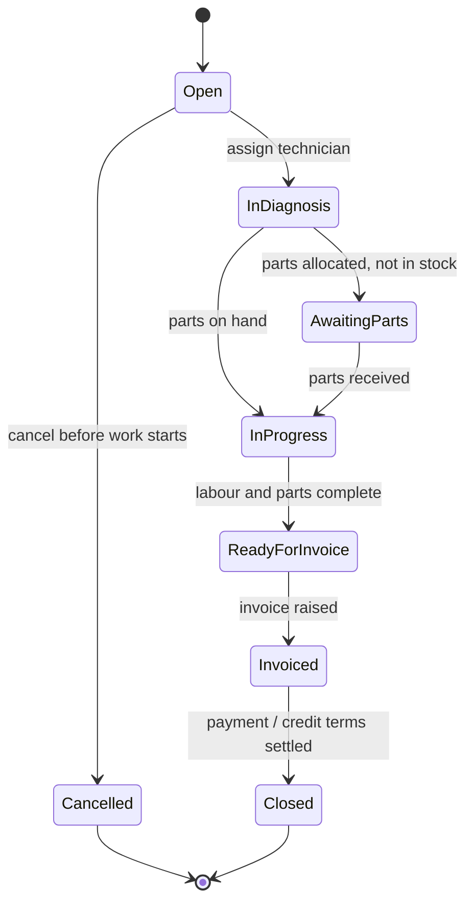
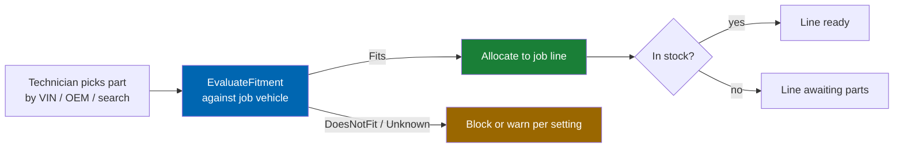
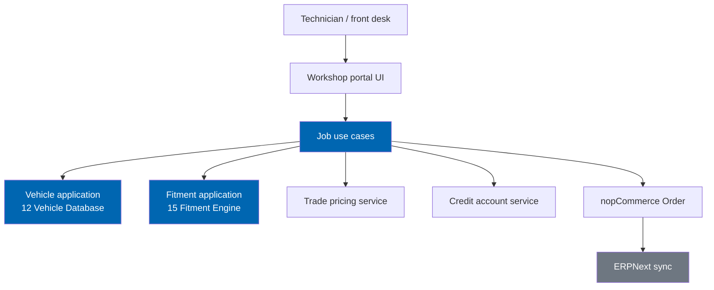
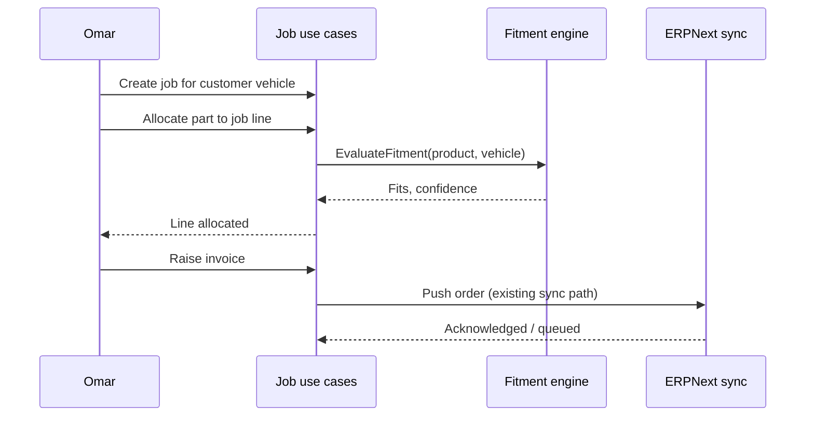

# 46 Workshop Portal

> Job-based ordering, labour estimates, workshop customer vehicle records, trade pricing, parts-to-job
> allocation, multi-vehicle jobs, technician roles, and credit terms for independent and multi-bay
> workshops — built entirely on the core vehicle and fitment engines.

**Status:** Review · **Owner:** Product Owner · **Last revised:** 2026-07-28

---

## Contents

- [Executive Summary](#executive-summary)
- [Objectives](#objectives)
- [Scope](#scope)
- [Detailed Specifications](#detailed-specifications)
  - [Persona fit](#persona-fit)
  - [Job model](#job-model)
  - [Multi-vehicle jobs](#multi-vehicle-jobs)
  - [Labour estimates](#labour-estimates)
  - [Parts-to-job allocation](#parts-to-job-allocation)
  - [Workshop customer vehicle records](#workshop-customer-vehicle-records)
  - [Trade pricing](#trade-pricing)
  - [Credit terms](#credit-terms)
  - [Technician roles and permissions](#technician-roles-and-permissions)
  - [Fitment stays core — no forked logic](#fitment-stays-core--no-forked-logic)
  - [Schema sketch](#schema-sketch)
  - [API contracts](#api-contracts)
- [Architecture](#architecture)
- [User Stories](#user-stories)
- [Acceptance Criteria](#acceptance-criteria)
- [Future Enhancements](#future-enhancements)
- [References](#references)

---

## Executive Summary

The workshop portal is Horizon 4's first release (`v1.3`, `EP-25`): a job-centric ordering surface for
independent and multi-bay workshops that replaces the retail cart with a **Job**, the unit workshops
actually think in. A job groups one or more customer vehicles, a labour estimate, and the parts
allocated against it, and it is billed on trade terms rather than a consumer checkout.

Takeaways:

1. **The job, not the cart, is the primary object** (`FR-1001`). A workshop technician (Omar, [06](06-personas.md#p4--omar-workshop-technician-primary-trade))
   opens a job per customer vehicle on the ramp and allocates parts to it as diagnosis proceeds.
2. **Fitment is never reimplemented.** Every part allocated to a job line is evaluated by the same
   [15 Fitment Engine](15-fitment-engine.md) API used by the retail storefront — `EvaluateFitment` and
   `EvaluateFitmentBatch` — with no workshop-specific fitment table, rule, or shortcut. This is the
   Horizon 4 exit criterion in [ROADMAP.md](../ROADMAP.md#horizon-4--verticals): *"the portal's data
   model reuses the core vehicle and fitment engines with no forked logic."*
3. **Workshop customer vehicle records are a bounded extension of the garage**, not a parallel vehicle
   store (`FR-1010`, extending `FR-712`).
4. **Trade pricing and credit terms are server-enforced**, never a storefront display convention
   (`FR-1020`, `FR-1022`).
5. **The primary workflow completes without the retail storefront** (`AC-46.1`) — a workshop can raise,
   allocate, and invoice a job without a single retail cart or checkout page in the path.

This document specifies `v1.3` behaviour built after the Horizon 3 marketplace and does not reopen any
Horizon 1–3 decision; it is additive.

---

## Objectives

| # | Objective | Traces to | Measure |
|---|---|---|---|
| 1 | Specify the job aggregate and its lifecycle | `FR-1001`–`FR-1006` | Domain + API tests |
| 2 | Bind every job line to the existing fitment engine with no forked evaluation path | `FR-1007`, ROADMAP H4 exit criteria | Architecture test: zero fitment logic in portal assembly |
| 3 | Specify multi-vehicle jobs and parts-to-job allocation | `FR-1003`, `FR-1008` | Scenario tests |
| 4 | Specify workshop customer vehicle records reusing the garage/vehicle model | `FR-1010`–`FR-1012` | Integration test against `CeGarage*` extension |
| 5 | Specify trade pricing, credit terms, and technician roles enforced server-side | `FR-1020`–`FR-1025` | Authz + pricing tests |
| 6 | Prove the primary workflow needs no retail storefront page | `AC-46.1` | Journey walkthrough with storefront routes disabled |

---

## Scope

### In scope

- Job aggregate: creation, multi-vehicle grouping, labour estimate, status lifecycle
- Parts-to-job allocation and its interaction with stock, pricing, and fitment
- Workshop customer vehicle records (a workshop's own customers' cars, not the workshop's own fleet)
- Trade pricing tiers and credit account terms for workshop accounts
- Technician role model and job-level permissions
- Conceptual schema (`CeJob`, `CeJobLine`, and related tables) and host-internal API contracts

### Out of scope

| Not covered | Where |
|---|---|
| Fitment evaluation algorithm | [15 Fitment Engine](15-fitment-engine.md) — reused, not respecified |
| Vehicle hierarchy and configuration model | [12 Vehicle Database](12-vehicle-database.md) — reused, not respecified |
| Customer garage core behaviour (retail) | [20 Customer Garage](20-customer-garage.md) |
| Fleet-scale bulk registers and approval workflows | [47 Fleet Portal](47-fleet-portal.md) |
| Dealer allocation, quota, and warranty claims | [48 Dealer Portal](48-dealer-portal.md) |
| ERP invoicing and payment capture mechanics | [18 ERPNext Integration](18-erpnext-integration.md) |
| Marketplace vendor isolation | [19 Marketplace Module](19-marketplace-module.md) — a workshop is a **buyer** account type, not a seller |

### Assumptions

- The workshop portal ships after Horizon 3; marketplace mode may or may not be enabled independently.
- A workshop is a nopCommerce `Customer` with a workshop account flag and one or more technician
  sub-users; it is not a new host entity type.
- Job identifiers, labour estimates, and credit terms are Check Engine-owned data; nopCommerce `Order`
  remains the transactional record once a job is invoiced (`FR-1006`).
- TDD applies to job lifecycle transitions, pricing resolution, and credit limit enforcement
  (`ADR-015`).

### Dependencies

[06](06-personas.md) (Omar, Youssef), [11](11-domain-model.md), [12](12-vehicle-database.md),
[15](15-fitment-engine.md), [18](18-erpnext-integration.md), [20](20-customer-garage.md),
[28](28-security.md), `FR-712`, new Block 1000.

---

## Detailed Specifications

### Persona fit

| Persona | Portal need | Reference |
|---|---|---|
| Omar — workshop technician | Sub-three-minute verified allocation per job line while the vehicle is on the ramp | [06](06-personas.md#p4--omar-workshop-technician-primary-trade) |
| Youssef — workshop owner | Trade pricing, credit terms, consolidated monthly invoicing, less admin | [06](06-personas.md#p5--youssef-workshop-owner) |

The portal is proven against Omar for the technician-facing flow and against Youssef for the
account-level configuration, matching the persona design rule in [06](06-personas.md#executive-summary).

### Job model

A **Job** (`FR-1001`) is the workshop's unit of work: one workshop customer, one or more vehicles, a
labour estimate, and the parts allocated as diagnosis and repair proceed.

| Field | Rule |
|---|---|
| `WorkshopAccountId` | The workshop's trade account |
| `TechnicianId` | Assigned technician (`FR-1024`); reassignable |
| `WorkshopCustomerId` | The workshop's own end customer (not a Check Engine storefront customer) |
| `Status` | `Open → InDiagnosis → AwaitingParts → InProgress → ReadyForInvoice → Invoiced → Closed`, plus `Cancelled` |
| `LabourEstimateMinor` | Estimated labour charge, currency-minor-unit integer (`FR-1004`) |
| `Reference` | Workshop's own job/ticket number, freeform, optional |
| `CreatedOnUtc` / `UpdatedOnUtc` | Standard audit timestamps |

**Invoicing (`FR-1006`):** raising an invoice from a `ReadyForInvoice` job creates a nopCommerce `Order`
against the workshop account, priced per [Trade pricing](#trade-pricing); Check Engine does not invent a
parallel order or invoice entity. ERPNext sync then follows [18](18-erpnext-integration.md) unchanged.

### Multi-vehicle jobs

A job may reference more than one vehicle (`FR-1003`) — for example, a fleet drop-off of three cars for
the same workshop customer in one visit.

| Rule | Detail |
|---|---|
| `CeJobVehicle` link | One row per vehicle on the job; each resolves to a `VehicleConfigurationId` via the same VIN/selector path as retail (`FR-1002`) |
| Job line binding | Every `CeJobLine` references exactly one `CeJobVehicle`, so fitment is always evaluated against a specific vehicle, never "the job" in the abstract |
| Split invoicing | Should (`FR-1009`): a multi-vehicle job may invoice per vehicle when the workshop customer requires separate paperwork per car |

### Labour estimates

| Rule (`FR-1004`) | Detail |
|---|---|
| Estimate entry | Free-entry amount or from an optional labour rate table (`FR-1005`, Should) keyed by operation code |
| Estimate vs actual | Both fields retained; variance is informational, not enforced |
| Currency | Follows store currency; multi-currency workshops use the host's multi-currency support unchanged |

Labour rate tables are Should-priority because a workshop with no rate card can still enter a labour
figure manually and use the portal from day one.

### Parts-to-job allocation

A **Job Line** (`CeJobLine`, `FR-1007`) allocates a product and quantity to a job vehicle.

| Rule | Detail |
|---|---|
| Fitment call (`FR-1007`) | Every allocation calls the fitment engine's `EvaluateFitment` for the job line's product and vehicle; no cached workshop-only fitment shortcut |
| DoesNotFit / Unknown (`FR-1008`) | Default: block allocation with the reason code from the fitment response; operators may permit an explicit override with audit for `Unknown` only — never for `DoesNotFit` |
| Stock check | Host stock rules apply unchanged; `AwaitingParts` status reflects backorder |
| Pricing | Resolved at allocation time per [Trade pricing](#trade-pricing); price is snapshotted on the line, matching the marketplace commission snapshot pattern in [19](19-marketplace-module.md#commission-models) |
| Removal | Lines may be removed before invoicing; removal is audited |

### Workshop customer vehicle records

Workshops keep records for **their own customers' vehicles** — a garage-like register scoped to the
workshop account rather than to an individual Check Engine storefront customer.

| Topic | Rule |
|---|---|
| Data model (`FR-1010`) | Extends the garage pattern in [20](20-customer-garage.md): `CeWorkshopCustomer` and `CeWorkshopCustomerVehicle` reuse `VehicleConfigurationId` and the same VIN-save path; no parallel vehicle hierarchy |
| Relationship to `FR-712` | This is the Horizon 4 realisation of `FR-712` ("shared garages / vehicle registers at organisation level"), scoped to workshop accounts specifically |
| Multiple vehicles per workshop customer | Unlike the single-customer garage's one-active-vehicle rule (`INV-009`), a workshop customer record may list many vehicles with no "active" concept — the job, not the record, carries the working context |
| Service history (`FR-1011`, Should) | Optional list of past jobs against the vehicle, for workshop reference; not a manufacturer service-book equivalent and not represented as such to end customers |
| Privacy | Workshop customer records belong to the workshop account (`WorkshopAccountId`), not to a Check Engine storefront `CustomerId`; export/erasure obligations for the underlying private individual follow the workshop operator's own data-controller responsibilities, with Check Engine providing an export function (`FR-1012`) the workshop can use to fulfil its own obligations |

### Trade pricing

| Rule (`FR-1020`) | Detail |
|---|---|
| Price list | Workshop accounts resolve against a trade price list or discount-from-retail rule, evaluated server-side at allocation and at invoice time |
| Tiering | Should (`FR-1021`): volume or account-tier bands, data-driven, no code branch per tier |
| Snapshot | Effective price is snapshotted on the job line; a price list change after allocation does not silently reprice an open job |
| Display | Trade price never leaks to retail-authenticated sessions on the same product page |

### Credit terms

| Rule (`FR-1022`) | Detail |
|---|---|
| Credit account | Workshop account carries an optional credit limit and payment terms (e.g. Net 30) |
| Enforcement (`FR-1023`) | Invoicing beyond the credit limit is blocked server-side pending operator override; never a UI-only warning |
| Statement | Periodic statement of invoiced jobs against the credit account, consistent in shape with the marketplace payout statement pattern in [19](19-marketplace-module.md#payouts-and-erp-reconciliation) |
| ERP | Credit account balance reconciles through the existing ERPNext customer/invoice sync ([18](18-erpnext-integration.md)); Check Engine does not become a second ledger |

### Technician roles and permissions

| Role (`FR-1024`) | Capability |
|---|---|
| Workshop owner/manager | Full job management, pricing view, credit account view, technician management |
| Technician | Create/update jobs and lines assigned to them; cannot see credit terms or account-level pricing configuration |
| Front desk (Should) | Create jobs, assign technicians, raise invoices; cannot edit labour rate tables |

| Rule (`FR-1025`) | Detail |
|---|---|
| Enforcement | Server-side permission checks per [28 Security](28-security.md#authorisation-and-permissions), following the same pattern as `ManageCheckEngineFitment` and `ManageCheckEngineErp` |
| New permission | `ManageCheckEngineWorkshop` gates account-level configuration; job CRUD checks technician assignment in addition to the permission |
| Audit | Job status changes, price overrides, and credit overrides are audit-logged (`FR-970` pattern) |

### Fitment stays core — no forked logic

This is the load-bearing constraint of the whole document, restated because it is the Horizon 4 exit
gate:

| Rule | Detail |
|---|---|
| Single fitment authority | The portal calls [15 Fitment Engine](15-fitment-engine.md)'s existing `EvaluateFitment` / `EvaluateFitmentBatch` contracts unchanged |
| Single vehicle authority | The portal calls [12 Vehicle Database](12-vehicle-database.md)'s existing read API (`GetConfiguration`, `SearchNodes`) unchanged |
| No portal-owned fitment table | `CeJob*` tables carry no `FitmentStatus`, confidence, or qualifier columns of their own |
| No portal-owned vehicle table | `CeJobVehicle` stores a `VehicleConfigurationId` foreign key and, optionally, a VIN — it does not duplicate make/model/generation data |
| Architecture test | CI includes a dependency check asserting the workshop portal assembly has no direct reference to fitment or vehicle *storage*, only to the published Application service interfaces (`AC-46.4`) |

### Schema sketch

Conceptual — normative DDL follows [10 Database Design](10-database-design.md) conventions when this
phase enters implementation planning.

| Table | Purpose |
|---|---|
| `CeWorkshopAccount` | Workshop trade account: credit limit, terms, default price list |
| `CeTechnician` | Technician user linked to a nopCommerce `Customer` sub-account and a `WorkshopAccountId` |
| `CeWorkshopCustomer` | The workshop's own end customer record (name, contact — minimal PII) |
| `CeWorkshopCustomerVehicle` | Vehicle owned by a workshop customer; `VehicleConfigurationId` FK, optional VIN |
| `CeJob` | Job header: workshop account, technician, workshop customer, status, labour estimate |
| `CeJobVehicle` | Vehicle(s) attached to a job; FK to `CeWorkshopCustomerVehicle` or `VehicleConfigurationId` directly |
| `CeJobLine` | Product, quantity, allocated vehicle, fitment outcome snapshot, price snapshot |
| `CeLabourRate` | Optional operation-code labour rate table |
| `CePriceList` / `CePriceListItem` | Trade pricing, shared shape with future dealer tiers ([48](48-dealer-portal.md)) where sensible, not force-unified |

`CeJob` and `CeJobLine` reuse `ProductId` (nopCommerce) and `VehicleConfigurationId` ([12](12-vehicle-database.md))
exactly as `CeFitmentClaim` does ([10](10-database-design.md#table-specifications)) — integer references,
no duplication.

### API contracts

Host-internal Application services, following the pattern in [12](12-vehicle-database.md#read-api-and-caching)
and [15](15-fitment-engine.md#api-contracts):

**`CreateJob`** — workshop account id, workshop customer id, one or more vehicle references (configuration
id and/or VIN).

**`AllocateJobLine`** — job id, job vehicle id, product id, quantity. Internally calls `EvaluateFitment`
before persisting the line; returns the fitment outcome to the caller for UI feedback.

**`TransitionJobStatus`** — job id, target status; validates the state machine above.

**`RaiseJobInvoice`** — job id (or job + vehicle id for split invoicing); creates the nopCommerce `Order`
and returns its id.

All mutating calls require `ManageCheckEngineWorkshop` or an assigned-technician check, and are rate
limited and audited per [28 Security](28-security.md).

---

## Architecture

The job use cases sit beside, not inside, the fitment and vehicle applications — a horizontal
dependency, never a fork. This mirrors the layering rule already established for search and the garage
in [08 System Architecture](08-system-architecture.md#layering-and-dependency-rules).

### Sequence — allocate and invoice

### Rejected alternatives

| Alternative | Rejected because |
|---|---|
| Workshop-specific fitment shortcut table for speed | Violates the Horizon 4 exit criterion and `ADR-006`; the existing cache ([15](15-fitment-engine.md#bulk-evaluation-and-caching)) already meets the latency budget |
| Duplicate vehicle hierarchy scoped to workshops | Violates brand-agnostic and single-source-of-truth principles ([10](10-database-design.md#design-principles)) |
| Retail cart repurposed with a "job" label | Does not model multi-vehicle jobs, labour, or credit terms; would force retail checkout assumptions onto trade billing |
| Free-text labour and parts note on the order | No structured allocation, no fitment check, no reporting — the status quo this document exists to fix |

---

## User Stories

| ID | Persona | Story | FR | Points | Priority |
|---|---|---|---|---|---|
| `US-1000` | Omar | Open a job for a customer vehicle and allocate a verified-fit part in under three minutes | `FR-1001`, `FR-1007` | 8 | Must |
| `US-1001` | Omar | See a job line blocked when a part does not fit the job vehicle | `FR-1008` | 5 | Must |
| `US-1002` | Youssef | Set a credit limit and see invoicing blocked once exceeded | `FR-1022`, `FR-1023` | 8 | Must |
| `US-1003` | Youssef | Configure a trade price list without touching retail pricing | `FR-1020` | 5 | Must |
| `US-1004` | Front desk | Record three vehicles on one drop-off job | `FR-1003` | 5 | Should |
| `US-1005` | Workshop owner | Export a workshop customer's vehicle history for a data request | `FR-1012` | 3 | Should |

---

## Acceptance Criteria

**`AC-46.1`** — Primary workflow without retail storefront
Given a workshop account with technicians configured, when a job is created, parts allocated, and an
invoice raised, then no retail storefront cart or checkout route is used at any step (`ROADMAP.md`
Horizon 4 exit criteria).

**`AC-46.2`** — Fitment reuse
Given a job line allocation, when the fitment outcome is inspected, then it was produced by
`EvaluateFitment` in [15 Fitment Engine](15-fitment-engine.md) and no workshop-local fitment computation
exists (`FR-1007`).

**`AC-46.3`** — Hard block on DoesNotFit
Given a job line allocation where fitment evaluates `DoesNotFit`, when the technician attempts to
allocate, then the allocation is rejected with no override path (`FR-1008`).

**`AC-46.4`** — No forked storage
Given the workshop portal assembly, when a dependency analysis is run, then it references the vehicle
and fitment Application interfaces only, with no direct table or repository access to `CeVehicle*` or
`CeFitmentClaim` (`ROADMAP.md` Horizon 4 exit criteria).

**`AC-46.5`** — Credit enforcement
Given a workshop account at its credit limit, when `RaiseJobInvoice` is called, then it fails server-side
regardless of client-side state (`FR-1023`).

**`AC-46.6`** — Multi-vehicle split
Given a job with three vehicles, when split invoicing is requested, then one invoice per vehicle is
produced with no cross-vehicle line leakage (`FR-1009`).

---

## Future Enhancements

| Enhancement | Horizon | Notes |
|---|---|---|
| Labour rate table by operation code | 4 (Should) | `FR-1005` |
| Service history surfaced to workshop customers directly (self-service portal) | 5 | Depends on public API |
| Parts kitting per common job type | 4+ | Data-driven, reuses `CeOemRelation` kit-member type ([10](10-database-design.md#oem)) |
| Technician mobile / tablet ramp-side UI | 4+ | UX extension, no new domain rule |

---

## References

- [06 Personas](06-personas.md) — Omar, Youssef
- [12 Vehicle Database](12-vehicle-database.md)
- [15 Fitment Engine](15-fitment-engine.md)
- [18 ERPNext Integration](18-erpnext-integration.md)
- [19 Marketplace Module](19-marketplace-module.md) — pricing snapshot and statement patterns
- [20 Customer Garage](20-customer-garage.md) — vehicle record pattern
- [28 Security](28-security.md)
- [10 Database Design](10-database-design.md)
- [ROADMAP.md](../ROADMAP.md#horizon-4--verticals) — `v1.3`, exit criteria
- [01 Business Requirements](01-business-requirements.md) — `BR-028`
