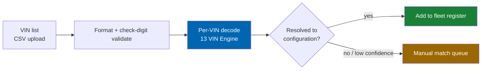
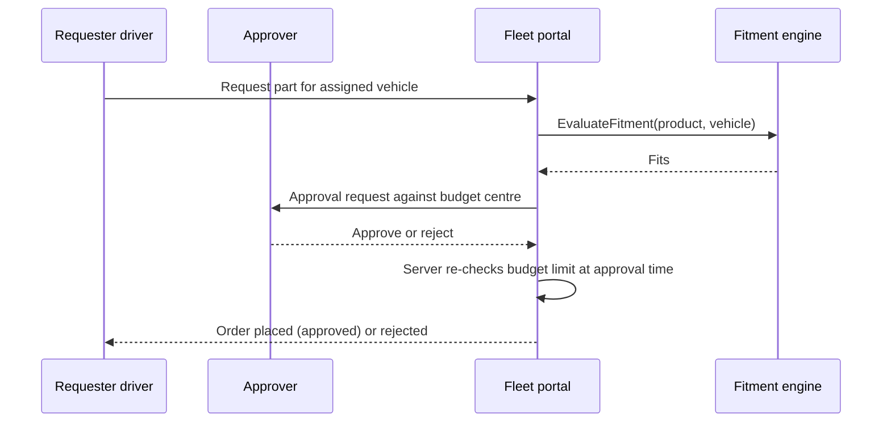
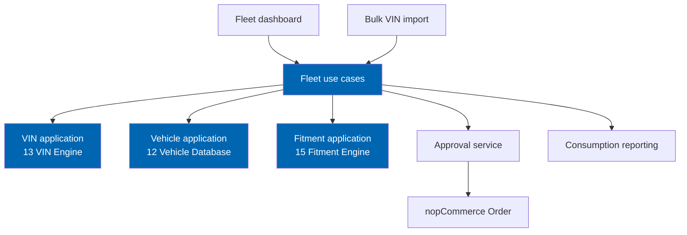

# 47 Fleet Portal

> Bulk vehicle registers, scheduled maintenance forecasting, consumption analytics, cost-per-vehicle
> reporting, approval workflows, budget centres, and VIN bulk import for fleet operators — built on the
> same vehicle database every other module reads from.

**Status:** Review · **Owner:** Product Owner · **Last revised:** 2026-07-28

---

## Contents

- [Executive Summary](#executive-summary)
- [Objectives](#objectives)
- [Scope](#scope)
- [Detailed Specifications](#detailed-specifications)
  - [Persona fit](#persona-fit)
  - [Bulk vehicle registers](#bulk-vehicle-registers)
  - [VIN bulk import](#vin-bulk-import)
  - [Scheduled maintenance forecasting](#scheduled-maintenance-forecasting)
  - [Consumption analytics and cost-per-vehicle](#consumption-analytics-and-cost-per-vehicle)
  - [Budget centres](#budget-centres)
  - [Approval workflows](#approval-workflows)
  - [Reuse of the core vehicle engine](#reuse-of-the-core-vehicle-engine)
  - [Schema sketch](#schema-sketch)
  - [API contracts](#api-contracts)
- [Architecture](#architecture)
- [User Stories](#user-stories)
- [Acceptance Criteria](#acceptance-criteria)
- [Future Enhancements](#future-enhancements)
- [References](#references)

---

## Executive Summary

The fleet portal is Horizon 4's second release (`v1.4`, `EP-26`): a register-and-approve model for
operators managing tens to hundreds of vehicles, replacing the one-VIN-at-a-time retail flow with bulk
registration, forecasted maintenance, and spend control that a fleet manager (Mona,
[06](06-personas.md#p6--mona-fleet-manager)) can run without touching the retail storefront for routine
ordering.

Takeaways:

1. **The register is bulk, the vehicle model is not new.** Every fleet vehicle resolves to the existing
   `VehicleConfigurationId` from [12 Vehicle Database](12-vehicle-database.md); the fleet portal adds
   organisation-scoped grouping and reporting, not a second vehicle catalog (`FR-1101`).
2. **Approval is server-enforced.** A requester's order line does not become a purchase until an
   approver authorises it against a budget centre, checked on the server on every transition, never in
   the client (`FR-1120`, `AC-47.4`).
3. **Forecasting is a scheduling aid, not a fitment authority.** Predicted maintenance dates never
   bypass fitment evaluation when the predicted part is actually ordered (`FR-1110`).
4. **Cost-per-vehicle and consumption analytics read from existing order and fitment data** plus new
   fleet-scoped aggregation tables — they do not require a parallel transactional ledger (`FR-1112`).
5. **Bulk VIN import reuses the VIN engine's single-decode path** at scale, with the same confidence and
   failure semantics as a single customer decode (`FR-1102`).

This document is additive to Horizon 1–3 and does not reopen the vehicle or fitment specifications.

---

## Objectives

| # | Objective | Traces to | Measure |
|---|---|---|---|
| 1 | Specify the fleet vehicle register as an organisation-scoped view over the core vehicle model | `FR-1101` | No new vehicle hierarchy tables |
| 2 | Specify bulk VIN import reusing the single-VIN decode contract | `FR-1102` | Batch test: N decodes match N individual decode outcomes |
| 3 | Specify maintenance forecasting and its explicit non-authority over fitment | `FR-1110`, `FR-1111` | Policy unit tests |
| 4 | Specify cost-per-vehicle and consumption reporting | `FR-1112`, `FR-1113` | Report correctness tests against seeded order data |
| 5 | Specify budget centres and requester/approver enforcement, server-side only | `FR-1120`–`FR-1123` | Authz + negative tests |

---

## Scope

### In scope

- Fleet account and bulk vehicle register model
- VIN bulk import batch process
- Scheduled maintenance forecasting rules and notification model
- Consumption analytics and cost-per-vehicle reporting
- Budget centres and requester/approver workflow
- Conceptual schema and host-internal API contracts

### Out of scope

| Not covered | Where |
|---|---|
| Vehicle hierarchy, configuration model | [12 Vehicle Database](12-vehicle-database.md) — reused |
| VIN decode algorithm | [13 VIN Engine](13-vin-engine.md) — reused |
| Fitment evaluation | [15 Fitment Engine](15-fitment-engine.md) — reused |
| Job-based trade ordering for workshops | [46 Workshop Portal](46-workshop-portal.md) |
| Dealer allocation and quota | [48 Dealer Portal](48-dealer-portal.md) |
| ERP financial posting mechanics | [18 ERPNext Integration](18-erpnext-integration.md) |
| OBD-II telemetry or usage-based maintenance triggers | Out of product scope; see [ROADMAP.md](../ROADMAP.md#what-we-are-not-doing) |

### Assumptions

- A fleet is a nopCommerce `Customer` account flagged as a fleet account, with requester sub-users, not
  a new host entity type — consistent with the workshop account model in [46](46-workshop-portal.md).
- Maintenance forecasting is schedule-based (distance or time interval as supplied by the fleet
  operator), not derived from vehicle telemetry, which this product does not collect
  ([ROADMAP.md](../ROADMAP.md#what-we-are-not-doing)).
- TDD applies to approval-limit enforcement, budget allocation, and forecast date calculation
  (`ADR-015`).

### Dependencies

[06](06-personas.md) (Mona, Sara), [12](12-vehicle-database.md), [13](13-vin-engine.md),
[15](15-fitment-engine.md), [18](18-erpnext-integration.md), [28](28-security.md), `FR-712`, new Block
1100.

---

## Detailed Specifications

### Persona fit

| Persona | Portal need | Reference |
|---|---|---|
| Mona — fleet manager | Cost per vehicle, scheduled maintenance, approval workflows across dozens to hundreds of vehicles | [06](06-personas.md#p6--mona-fleet-manager) |
| Sara — company car driver | A simple, guided path to order an approved consumable against her assigned vehicle without knowing fleet administration | [06](06-personas.md#p3--sara-company-car-driver) |

### Bulk vehicle registers

| Rule (`FR-1101`) | Detail |
|---|---|
| Register scope | `CeFleetVehicle` groups vehicles under a `FleetAccountId`; each row resolves to a `VehicleConfigurationId` exactly as a garage vehicle does |
| Identification | By VIN (preferred, `FR-1102`), by manual selector, or by an operator-provided asset tag stored alongside the vehicle row |
| Assignment | Optional `AssignedDriverCustomerId` links a vehicle to a driver account (e.g. Sara) for self-service ordering within policy |
| Relationship to `FR-712` | This is the fleet-scale realisation of `FR-712` (organisation-level shared vehicle registers), sized for hundreds of vehicles rather than a workshop's per-visit list |
| No parallel hierarchy | The register never stores make/model/generation text; it references the existing hierarchy, so a fleet of BMWs and a second manufacturer's vehicles coexist without any fleet-specific schema branch |

### VIN bulk import

| Rule (`FR-1102`) | Detail |
|---|---|
| Reuse | Each row calls the same VIN decode service used for a single customer decode ([13](13-vin-engine.md)); there is no bulk-only decode shortcut or relaxed confidence rule |
| Batch size | Configurable cap per upload (default reference: 2,000 rows) to bound synchronous request load; larger files process as a background batch |
| Partial failure | Rows that fail check-digit or fail to resolve enter a review queue; the batch is not rejected wholesale (`FR-1103`, mirroring `FR-643`'s partial-failure rule in [24](24-product-import-pipeline.md)) |
| Duplicate VINs | Idempotent upsert by normalised VIN within the fleet account |
| Privacy | Bulk VIN handling follows the same logging redaction rule as single decodes — no raw VIN in Information-level logs by default ([13](13-vin-engine.md), `NFR-044`) |

### Scheduled maintenance forecasting

| Rule (`FR-1110`) | Detail |
|---|---|
| Schedule source | Operator- or fleet-supplied interval rules (distance, time, or both) per vehicle or vehicle class; not derived from telemetry |
| Forecast output | Predicted next-service date/distance per vehicle, surfaced on the fleet dashboard and via notification |
| Non-authority over fitment (`FR-1111`) | A forecast identifies *when* service is likely due; it never supplies or substitutes for a fitment evaluation when a part is actually selected — the requester still goes through `EvaluateFitment` against the vehicle's configuration, exactly as in retail and the workshop portal |
| Missed service | Overdue forecasts are flagged, not auto-escalated into an order; ordering remains a human or approved-workflow action |

### Consumption analytics and cost-per-vehicle

| Rule (`FR-1112`) | Detail |
|---|---|
| Source data | Aggregates from existing nopCommerce `Order` lines linked to fleet vehicles and from published fitment claims used at time of order; no duplicate transactional ledger |
| Metrics | Spend per vehicle, spend per budget centre, part-category consumption trend, average interval between part-category purchases |
| Reporting cadence | Should (`FR-1113`): scheduled report export (CSV) plus an on-demand dashboard view |
| Attribution | An order line attributes to a vehicle only when placed through the fleet portal against a registered `CeFleetVehicle`; retail orders placed outside the portal are out of scope for this attribution |

### Budget centres

| Rule (`FR-1121`) | Detail |
|---|---|
| Model | `CeBudgetCentre` groups vehicles and/or requesters under a spend allocation, optionally time-boxed (e.g. quarterly) |
| Limit | Optional hard cap; exceeding it blocks approval, not just the order (`FR-1122`) |
| Reporting | Spend against a budget centre appears in the consumption analytics above, scoped by centre |

### Approval workflows

| Rule (`FR-1120`) | Detail |
|---|---|
| Roles | Requester (e.g. Sara) creates a request; approver (e.g. Mona or a delegate) authorises it |
| Server enforcement (`AC-47.4`) | The approval-required gate and the budget-limit check both execute server-side on the transition to Placed; a client that skips the approval screen cannot place the order |
| Delegation | Should: approver may delegate within a budget centre; delegation is audited |
| Rejection | Rejected requests remain visible to the requester with a reason; no silent drop |
| Fitment precedes approval | A request that fails fitment (`DoesNotFit`) is not offered for approval at all — the same hard block used in the workshop portal ([46](46-workshop-portal.md#parts-to-job-allocation)) |

### Reuse of the core vehicle engine

Restated as the load-bearing constraint, matching the equivalent section in
[46 Workshop Portal](46-workshop-portal.md#fitment-stays-core--no-forked-logic):

| Rule | Detail |
|---|---|
| Single vehicle authority | `CeFleetVehicle` stores `VehicleConfigurationId` (or a pending VIN awaiting resolution); it never stores make/model/generation text redundantly |
| Single fitment authority | Ordering through the fleet portal calls the unchanged `EvaluateFitment` / `EvaluateFitmentBatch` contracts |
| No portal-owned fitment table | Forecasting tables store dates and intervals, never fitment outcomes or confidence |
| Architecture test | Dependency check equivalent to `AC-46.4`, applied to the fleet portal assembly (`AC-47.5`) |

### Schema sketch

Conceptual — normative DDL follows [10 Database Design](10-database-design.md) conventions at
implementation planning time.

| Table | Purpose |
|---|---|
| `CeFleetAccount` | Fleet trade account, default budget centre, notification settings |
| `CeFleetVehicle` | Registered vehicle; `VehicleConfigurationId` FK, VIN, asset tag, assigned driver |
| `CeFleetVinImportBatch` / `CeFleetVinImportRow` | Bulk import batch and per-row outcome, shaped like `CeImportBatch` / `CeImportRow` ([10](10-database-design.md#import-pipeline)) |
| `CeMaintenanceSchedule` | Interval rule per vehicle or vehicle class |
| `CeMaintenanceForecast` | Computed next-due prediction per vehicle |
| `CeBudgetCentre` | Spend allocation grouping |
| `CeApprovalRequest` | Requester, approver, budget centre, status, linked order (once approved) |
| `CeFleetConsumptionSnapshot` | Periodic materialised aggregate for reporting performance, rebuildable from source order data |

### API contracts

Host-internal Application services, following the pattern in [46](46-workshop-portal.md#api-contracts):

**`ImportFleetVins`** — fleet account id, VIN list; returns a batch id and per-row status.

**`GetMaintenanceForecast`** — fleet account id (or vehicle id); returns predicted due dates.

**`SubmitApprovalRequest`** — fleet vehicle id, product id, quantity, budget centre id. Internally calls
`EvaluateFitment` before the request is created; a `DoesNotFit` result short-circuits with no request
created.

**`DecideApprovalRequest`** — request id, decision (approve/reject); re-validates the budget centre limit
at decision time, not only at request time.

All mutating calls require the fleet requester/approver role check and `ManageCheckEngineFleet`
(account-level configuration), and are audited per [28 Security](28-security.md).

---

## Architecture

### Rejected alternatives

| Alternative | Rejected because |
|---|---|
| Fleet-specific vehicle table keyed by asset tag alone | Loses the link to the fitment-eligible configuration; would require a second matching pass at order time |
| Telemetry-driven maintenance triggers | Out of product scope ([ROADMAP.md](../ROADMAP.md#what-we-are-not-doing)); a different product category |
| Client-side-only approval gate | Trivially bypassable; violates the server-side enforcement rule in [28 Security](28-security.md#authorisation-and-permissions) |
| Forecast auto-converts to order | Removes human judgement from spend decisions and from fitment context that may have changed since the schedule was set |

---

## User Stories

| ID | Persona | Story | FR | Points | Priority |
|---|---|---|---|---|---|
| `US-1100` | Mona | Import 200 VINs and see resolved vehicles plus a review queue for the rest | `FR-1102`, `FR-1103` | 8 | Must |
| `US-1101` | Mona | See predicted next-service dates across the fleet | `FR-1110` | 8 | Should |
| `US-1102` | Mona | See spend per vehicle and per budget centre for the quarter | `FR-1112`, `FR-1121` | 8 | Must |
| `US-1103` | Sara | Request an approved consumable for my assigned vehicle without fleet admin knowledge | `FR-1120` | 5 | Must |
| `US-1104` | Mona | Have a request over budget rejected automatically even if a client is compromised or outdated | `FR-1122`, `AC-47.4` | 5 | Must |

---

## Acceptance Criteria

**`AC-47.1`** — Bulk import parity
Given a VIN decoded individually and the same VIN decoded via bulk import, when both complete, then the
resolved vehicle configuration and confidence match (`FR-1102`).

**`AC-47.2`** — Forecast does not authorise fitment
Given a maintenance forecast for a vehicle, when the predicted part is ordered, then `EvaluateFitment` is
still called and its outcome governs whether the line can be allocated (`FR-1111`).

**`AC-47.3`** — Partial batch failure
Given a 100-row VIN batch with 5 malformed VINs, when the batch completes, then 95 vehicles are
registered and 5 rows are in the review queue (`FR-1103`).

**`AC-47.4`** — Server-side approval enforcement
Given a budget centre at its limit, when an approval decision attempts to approve a request that would
exceed it, then the server rejects the approval regardless of client state (`FR-1120`, `FR-1122`).

**`AC-47.5`** — No forked storage
Given the fleet portal assembly, when a dependency analysis is run, then it references the vehicle and
fitment Application interfaces only (`ROADMAP.md` Horizon 4 exit criteria).

**`AC-47.6`** — Cost-per-vehicle accuracy
Given a seeded set of orders against registered fleet vehicles, when the cost-per-vehicle report runs,
then totals reconcile exactly with the source order lines (`FR-1112`).

---

## Future Enhancements

| Enhancement | Horizon | Notes |
|---|---|---|
| Predictive forecasting from consumption history rather than fixed intervals | 5 | Candidate AI use case, still fitment-gated per [17](17-ai-architecture.md) |
| Fleet self-service driver mobile flow | 4+ | UX extension |
| Multi-level approval chains | 4+ | `FR-1120` extension |
| Integration with third-party telematics as an optional data source | Evaluated, not committed | [45 Future Roadmap](45-future-roadmap.md) |

---

## References

- [06 Personas](06-personas.md) — Mona, Sara
- [12 Vehicle Database](12-vehicle-database.md)
- [13 VIN Engine](13-vin-engine.md)
- [15 Fitment Engine](15-fitment-engine.md)
- [18 ERPNext Integration](18-erpnext-integration.md)
- [24 Product Import Pipeline](24-product-import-pipeline.md) — partial-failure batch pattern
- [28 Security](28-security.md)
- [46 Workshop Portal](46-workshop-portal.md) — sibling Horizon 4 portal, shared enforcement patterns
- [10 Database Design](10-database-design.md)
- [ROADMAP.md](../ROADMAP.md#horizon-4--verticals) — `v1.4`, exit criteria
- [01 Business Requirements](01-business-requirements.md) — `BR-028`
