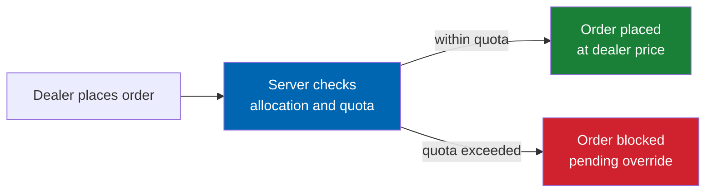
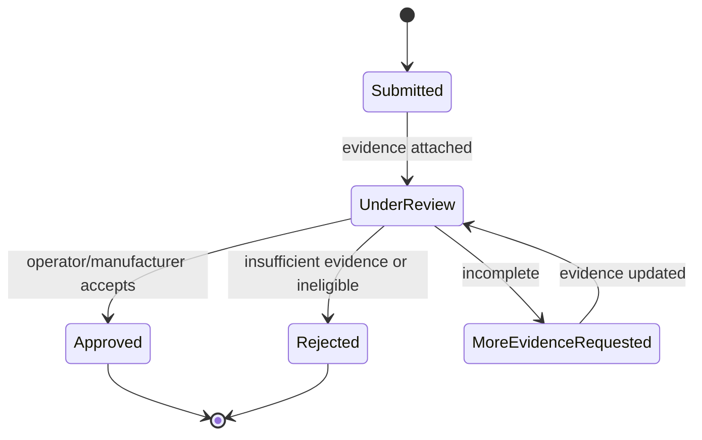
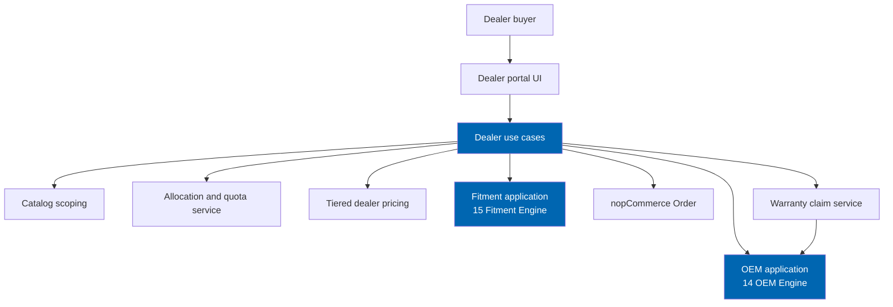

# 48 Dealer Portal

> Franchise-aware catalogs, allocation and quota management, tiered dealer pricing, and warranty claim
> support for authorised dealer accounts — distinct from marketplace vendors and built on the same
> vehicle, OEM, and fitment engines as every other module.

**Status:** Review · **Owner:** Product Owner · **Last revised:** 2026-07-28

**Engineering status (2026-08-25):** Plugin `0.104.0` is in tree. Progress, evidence gates (G1–G6 done; G11 packing partial), and remaining blockers (H1.35/G8, G7, G11 vendor signing, G12) are recorded in [EXECUTION-PLAN.md](../EXECUTION-PLAN.md). This document remains the specification baseline.

---

## Contents

- [Executive Summary](#executive-summary)
- [Objectives](#objectives)
- [Scope](#scope)
- [Detailed Specifications](#detailed-specifications)
  - [Dealer versus marketplace vendor](#dealer-versus-marketplace-vendor)
  - [Franchise-aware catalogs](#franchise-aware-catalogs)
  - [Allocation and quota](#allocation-and-quota)
  - [Tiered dealer pricing](#tiered-dealer-pricing)
  - [Territory rules](#territory-rules)
  - [Warranty claim support](#warranty-claim-support)
  - [Nominative trademark discipline](#nominative-trademark-discipline)
  - [Reuse of the core engines](#reuse-of-the-core-engines)
  - [Schema sketch](#schema-sketch)
  - [API contracts](#api-contracts)
- [Architecture](#architecture)
- [User Stories](#user-stories)
- [Acceptance Criteria](#acceptance-criteria)
- [Future Enhancements](#future-enhancements)
- [References](#references)

---

## Executive Summary

The dealer portal is Horizon 4's third release (`v1.5`, `EP-27`): a franchise-scoped buying experience
for authorised dealers operating under a manufacturer or distributor agreement, layering allocation,
quota, tiered pricing, and warranty claim support over the same catalog, vehicle, and fitment engines
every other Check Engine surface uses.

Takeaways:

1. **A dealer is a buyer account type with franchise constraints, not a marketplace seller.** The dealer
   portal governs how a dealer purchases from the operator's catalog under allocation and territory
   rules; it does not give the dealer a storefront of their own or vendor-style catalog ownership — see
   [Dealer versus marketplace vendor](#dealer-versus-marketplace-vendor) (`FR-1201`).
2. **Allocation and quota are enforced server-side at order placement**, never as a client-side display
   convention (`FR-1210`, `AC-48.3`).
3. **Warranty claims link evidence to OEM numbers through the existing OEM engine** — supersession and
   cross-reference resolution are not reimplemented for warranty purposes (`FR-1220`).
4. **Franchise catalogs are a visibility and pricing scope over the shared catalog**, not a duplicated
   product set (`FR-1202`).
5. **Nominative trademark discipline applies with extra weight here**, because a dealer portal is the
   surface most likely to reference a specific manufacturer's franchise mark by name (`FR-1230`,
   [LICENSE.md § 10](../LICENSE.md#10-trademarks-and-nominative-use)).

This document is additive to Horizon 1–3 and to the workshop and fleet portals; it does not reopen the
marketplace vendor model in [19](19-marketplace-module.md).

---

## Objectives

| # | Objective | Traces to | Measure |
|---|---|---|---|
| 1 | Define the dealer account type and its distinction from a marketplace vendor | `FR-1201` | Comparison table + isolation test that a dealer cannot list products like a vendor |
| 2 | Specify franchise-scoped catalog visibility and pricing | `FR-1202`, `FR-1203` | Scoped query tests |
| 3 | Specify allocation and quota enforcement at order time | `FR-1210`–`FR-1212` | Server-side negative tests |
| 4 | Specify warranty claim capture linked to OEM numbers and evidence | `FR-1220`–`FR-1222` | Integration test against [14 OEM Engine](14-oem-engine.md) |
| 5 | Keep nominative trademark obligations enforced in dealer-facing UI | `FR-1230` | Content review checklist |

---

## Scope

### In scope

- Dealer account model, franchise association, and its distinction from marketplace vendors
- Franchise-aware catalog scoping and tiered dealer pricing
- Allocation, quota, and territory rules
- Warranty claim capture: evidence, OEM number linkage, status workflow
- Conceptual schema and host-internal API contracts

### Out of scope

| Not covered | Where |
|---|---|
| Marketplace vendor onboarding, commissions, payouts | [19 Marketplace Module](19-marketplace-module.md) |
| Vehicle hierarchy, OEM registry, fitment evaluation algorithms | [12](12-vehicle-database.md), [14](14-oem-engine.md), [15](15-fitment-engine.md) — reused |
| Job-based workshop ordering | [46 Workshop Portal](46-workshop-portal.md) |
| Fleet bulk registers and approval workflows | [47 Fleet Portal](47-fleet-portal.md) |
| Manufacturer warranty adjudication or reimbursement processing | Operator's own franchise agreement and back office; Check Engine captures and evidences claims, it does not adjudicate them (`FR-1223`) |
| Full trademark legal analysis | [LICENSE.md § 10](../LICENSE.md#10-trademarks-and-nominative-use); this document states product behaviour only |

### Assumptions

- A dealer is a nopCommerce `Customer` account flagged as a dealer account with a franchise
  association, following the same account-type pattern as workshop and fleet accounts
  ([46](46-workshop-portal.md), [47](47-fleet-portal.md)).
- The operator remains the seller of record; the dealer portal does not introduce a second commerce
  party the way marketplace vendors do.
- Franchise, allocation, and quota data are operator-configured, sourced from the operator's own
  distribution agreements — Check Engine does not synchronise with a manufacturer's DMS.
- TDD applies to allocation/quota enforcement and warranty claim state transitions (`ADR-015`).

### Dependencies

[06](06-personas.md), [12](12-vehicle-database.md), [14](14-oem-engine.md), [15](15-fitment-engine.md),
[19](19-marketplace-module.md), [28](28-security.md), [LICENSE.md § 10](../LICENSE.md#10-trademarks-and-nominative-use),
`BR-014`, `BR-028`, new Block 1200.

---

## Detailed Specifications

### Dealer versus marketplace vendor

The two models are easy to conflate because both involve a distinct trade party; they solve different
problems and must not share isolation semantics.

| Aspect | Marketplace vendor ([19](19-marketplace-module.md)) | Dealer (this document) |
|---|---|---|
| Commercial role | Sells its own catalog to the operator's shoppers | Buys from the operator's catalog under a franchise agreement |
| Catalog ownership | Vendor owns and lists its own products (`FR-850`) | Operator owns the catalog; dealer sees a scoped view (`FR-1202`) |
| Isolation model | Hard cross-vendor isolation — a vendor cannot see another vendor's data (`FR-857`) | Dealers see only their own allocation, quota, pricing, and claims; there is no cross-vendor-style "other dealer's catalog" concept because there is one shared catalog |
| Pricing | Vendor sets its own price, subject to commission (`FR-853`) | Operator sets tiered dealer price lists; the dealer does not set retail prices (`FR-1211`) |
| Fitment attribution | Vendor may contribute fitment claims for review (`FR-856`) | Dealers do not contribute fitment claims in Horizon 4; they consume the same published claims as retail |
| Payout direction | Operator pays the vendor (commission-adjusted) | Dealer pays the operator (standard order flow, dealer-priced) |

`FR-1201`: **a dealer account shall never be represented, isolated, or billed as a marketplace vendor**,
and the two account types shall not share a table or isolation policy beyond the common
`Customer`-linkage pattern.

### Franchise-aware catalogs

| Rule (`FR-1202`) | Detail |
|---|---|
| Scoping mechanism | `CeDealerFranchise` associates a dealer account with one or more manufacturer/brand scopes (`MakeId` from [12](12-vehicle-database.md), or a manufacturer brand from [14](14-oem-engine.md) for parts-brand franchises) |
| Catalog visibility | Dealer-facing browsing and search filter to products within the dealer's franchise scope by default; this is a **view filter** over the shared catalog, not a separate product set |
| No catalog fork | `CeDealerFranchise` never duplicates product, vehicle, or OEM data; it stores scope references only |
| Cross-franchise browsing | Should (`FR-1203`): operator may permit a dealer to browse outside its franchise scope at standard (non-dealer) pricing, clearly labelled |

### Allocation and quota

| Rule (`FR-1210`) | Detail |
|---|---|
| Allocation | `CeDealerAllocation` grants a dealer a maximum sellable/orderable quantity for a product or category over a period, reflecting the operator's own supply commitment to that dealer |
| Quota | `CeDealerQuota` may instead (or additionally) express a period spend or unit target the dealer is expected to meet or is capped at, per the franchise agreement |
| Enforcement (`AC-48.3`) | Both allocation ceilings and quota caps are checked server-side at order placement, following the same pattern as the fleet portal's budget-centre enforcement ([47](47-fleet-portal.md#approval-workflows)) |
| Override | Operator-level manual override is permitted with audit; there is no client-side bypass |
| Period reset | Allocation/quota periods roll over on a configured schedule (e.g. monthly, quarterly); historical periods are retained for reporting |

### Tiered dealer pricing

| Rule (`FR-1211`) | Detail |
|---|---|
| Price list | Dealer accounts resolve against a franchise-scoped, tiered price list, following the same snapshot-at-order-time discipline as workshop trade pricing ([46](46-workshop-portal.md#trade-pricing)) and the marketplace commission snapshot pattern ([19](19-marketplace-module.md#commission-models)) |
| Tiering basis | Data-driven tiers (e.g. by dealer volume band or franchise level), never a code branch per dealer |
| Retail leakage | Dealer pricing never appears to a retail-authenticated session, matching the equivalent workshop rule |

### Territory rules

| Rule (`FR-1212`) | Detail |
|---|---|
| Scope | `CeDealerTerritory` may restrict a dealer's allocation or ordering eligibility to a defined geographic or market scope, reusing the existing `CeMarket` reference where the territory aligns with a fitment market qualifier ([12](12-vehicle-database.md#hierarchy-model)), otherwise a dealer-specific region code |
| Enforcement | Should: server-side check at order placement analogous to allocation; Must if the operator's franchise agreements are legally exclusive by territory |
| No fitment coupling | Territory governs *who may buy*, not *what fits* — it is never used as a fitment qualifier substitute |

### Warranty claim support

| Rule (`FR-1220`) | Detail |
|---|---|
| Claim record | `CeWarrantyClaim` links an order line (or a dealer-supplied reference for parts not sold through Check Engine), an OEM number, and the affected vehicle configuration |
| OEM number linkage | The claim's OEM number resolves through the existing [14 OEM Engine](14-oem-engine.md) registry and supersession chain — a claim against a superseded number surfaces the current number automatically (`FR-1221`), reusing `FR-224`/`FR-225` behaviour rather than reimplementing directed supersession |
| Evidence | Attachments (photographs, diagnostic notes, invoice reference) stored via the existing image/document handling pattern in [26 Image Management](26-image-management.md) where applicable |
| Status workflow | Submitted → Under review → (More evidence requested ⇄ Under review) → Approved / Rejected |
| Adjudication boundary (`FR-1223`) | Check Engine captures, evidences, and tracks claim status; the manufacturer or operator's own warranty process performs adjudication and reimbursement outside this system — Check Engine is not a warranty authority |
| Audit | Every status transition is audited, consistent with the fitment claim review audit pattern ([28](28-security.md#audit-logging)) |

### Nominative trademark discipline

| Rule (`FR-1230`) | Detail |
|---|---|
| Franchise naming | Where a dealer's franchise scope is displayed (e.g. "Authorised [Make] dealer"), the display follows the same disclaimer and nominative-use rules as manufacturer references elsewhere in the product (`FR-901`–`FR-905`), not a dealer-portal-specific exemption |
| No implied affiliation | The portal shall not imply that Twin Particles or the operator is endorsed by, or affiliated with, the vehicle manufacturer beyond the dealer's own factual franchise status, per [LICENSE.md § 10.2](../LICENSE.md#102-manufacturer-marks--your-obligation) |
| Operator responsibility retained | As with the wider product, Check Engine provides the disclaimer mechanism and configurable text; the operator remains responsible for the accuracy of franchise claims it publishes, per [LICENSE.md § 10.3](../LICENSE.md#103-no-legal-advice) |

### Reuse of the core engines

Restated as the load-bearing constraint, matching [46](46-workshop-portal.md#fitment-stays-core--no-forked-logic)
and [47](47-fleet-portal.md#reuse-of-the-core-vehicle-engine):

| Rule | Detail |
|---|---|
| Single vehicle authority | Warranty claims and franchise scoping reference `VehicleConfigurationId` and `MakeId`; no duplicated hierarchy |
| Single OEM authority | Warranty claims and franchise-scoped parts browsing reference `OemNumberId` and existing supersession relations; no duplicated registry |
| Single fitment authority | Dealer ordering evaluates fitment through the unchanged `EvaluateFitment` contract exactly as retail does |
| No portal-owned OEM/fitment table | `CeDealer*` and `CeWarrantyClaim` tables carry foreign keys, never their own OEM normalisation or fitment status columns |
| Architecture test | Dependency check equivalent to `AC-46.4` / `AC-47.5`, applied to the dealer portal assembly (`AC-48.5`) |

### Schema sketch

Conceptual — normative DDL follows [10 Database Design](10-database-design.md) conventions at
implementation planning time.

| Table | Purpose |
|---|---|
| `CeDealerAccount` | Dealer trade account, linked `Customer`, default price list |
| `CeDealerFranchise` | Dealer-to-scope association (`MakeId` and/or manufacturer brand) |
| `CeDealerAllocation` | Period allocation ceiling per product/category |
| `CeDealerQuota` | Period spend/unit quota |
| `CeDealerTerritory` | Geographic/market restriction |
| `CePriceList` / `CePriceListItem` | Tiered dealer pricing, shared shape with workshop trade pricing ([46](46-workshop-portal.md#schema-sketch)) where sensible |
| `CeWarrantyClaim` | Claim header: dealer, order line or external reference, OEM number, vehicle configuration, status |
| `CeWarrantyClaimEvidence` | Attachments and notes per claim |

### API contracts

Host-internal Application services, following the pattern in [46](46-workshop-portal.md#api-contracts)
and [47](47-fleet-portal.md#api-contracts):

**`GetDealerCatalogView`** — dealer account id; returns the franchise-scoped, dealer-priced catalog
view.

**`PlaceDealerOrder`** — dealer account id, line items. Internally checks allocation, quota, and
territory before delegating to standard order placement; a breach at any stage blocks the call.

**`SubmitWarrantyClaim`** — dealer account id, OEM number (or superseded number, auto-resolved), vehicle
configuration id, evidence references.

**`TransitionWarrantyClaim`** — claim id, target status; validates the state machine above.

All mutating calls require `ManageCheckEngineDealer` or the dealer's own account scope, and are audited
per [28 Security](28-security.md).

---

## Architecture

### Rejected alternatives

| Alternative | Rejected because |
|---|---|
| Model dealers as marketplace vendors with a "buy-only" flag | Conflates two isolation models with different failure modes; a bug in vendor isolation would then risk dealer allocation data, and vice versa |
| Duplicate OEM registry scoped per franchise | Breaks cross-manufacturer supersession visibility and violates single-source-of-truth ([10](10-database-design.md#design-principles)) |
| Client-side allocation/quota display only | Trivially bypassable; violates server-side enforcement in [28 Security](28-security.md#authorisation-and-permissions) |
| Check Engine adjudicates warranty claims | Out of scope — adjudication is a manufacturer/operator business process, not a commerce-platform function (`FR-1223`) |

---

## User Stories

| ID | Persona | Story | FR | Points | Priority |
|---|---|---|---|---|---|
| `US-1200` | Dealer buyer | See only my franchise's catalog at my tiered price | `FR-1202`, `FR-1211` | 8 | Must |
| `US-1201` | Dealer buyer | Be blocked from ordering beyond my monthly allocation | `FR-1210` | 8 | Must |
| `US-1202` | Dealer buyer | Submit a warranty claim with a superseded OEM number and see it resolve to the current number | `FR-1220`, `FR-1221` | 8 | Must |
| `US-1203` | Operator | Review and adjudicate a warranty claim's evidence externally while tracking status in the portal | `FR-1223` | 5 | Should |
| `US-1204` | Operator | Configure a dealer's franchise scope without touching vendor tables | `FR-1201`, `FR-1202` | 5 | Must |

---

## Acceptance Criteria

**`AC-48.1`** — Dealer is not a vendor
Given a dealer account and a marketplace vendor account, when isolation tests run, then no shared table
or isolation policy exists between the two beyond the common `Customer` linkage (`FR-1201`).

**`AC-48.2`** — Franchise scoping
Given a dealer scoped to one franchise, when the dealer catalog view is requested, then only products
within scope appear at the dealer's tiered price (`FR-1202`, `FR-1211`).

**`AC-48.3`** — Allocation enforcement
Given a dealer at its allocation ceiling, when `PlaceDealerOrder` is called for an additional unit, then
the call fails server-side regardless of client state (`FR-1210`).

**`AC-48.4`** — Warranty claim supersession
Given a warranty claim submitted against a superseded OEM number, when the claim is created, then the
current OEM number is attached via the existing supersession chain (`FR-1221`).

**`AC-48.5`** — No forked storage
Given the dealer portal assembly, when a dependency analysis is run, then it references the OEM,
vehicle, and fitment Application interfaces only (`ROADMAP.md` Horizon 4 exit criteria).

**`AC-48.6`** — No implied affiliation
Given a dealer franchise display, when rendered, then the configured disclaimer is present per
`FR-901`–`FR-905` (`FR-1230`).

---

## Future Enhancements

| Enhancement | Horizon | Notes |
|---|---|---|
| Dealer principal persona and multi-location dealer groups | 4+ | Extends [06 Personas](06-personas.md#future-enhancements) |
| Automated warranty evidence sufficiency check (AI-assisted) | 5 | Still non-authoritative; adjudication stays external (`FR-1223`) |
| Manufacturer DMS integration for allocation feed | Evaluated, not committed | [45 Future Roadmap](45-future-roadmap.md) |
| Territory-aware fitment market defaulting | 4+ | Convenience only; never a fitment qualifier substitute |

---

## References

- [06 Personas](06-personas.md)
- [12 Vehicle Database](12-vehicle-database.md)
- [14 OEM Engine](14-oem-engine.md)
- [15 Fitment Engine](15-fitment-engine.md)
- [19 Marketplace Module](19-marketplace-module.md) — the account type this document is distinct from
- [26 Image Management](26-image-management.md) — evidence attachment pattern
- [28 Security](28-security.md)
- [46 Workshop Portal](46-workshop-portal.md) · [47 Fleet Portal](47-fleet-portal.md) — sibling Horizon 4 portals
- [10 Database Design](10-database-design.md)
- [LICENSE.md § 10](../LICENSE.md#10-trademarks-and-nominative-use)
- [ROADMAP.md](../ROADMAP.md#horizon-4--verticals) — `v1.5`, exit criteria
- [01 Business Requirements](01-business-requirements.md) — `BR-014`, `BR-028`
