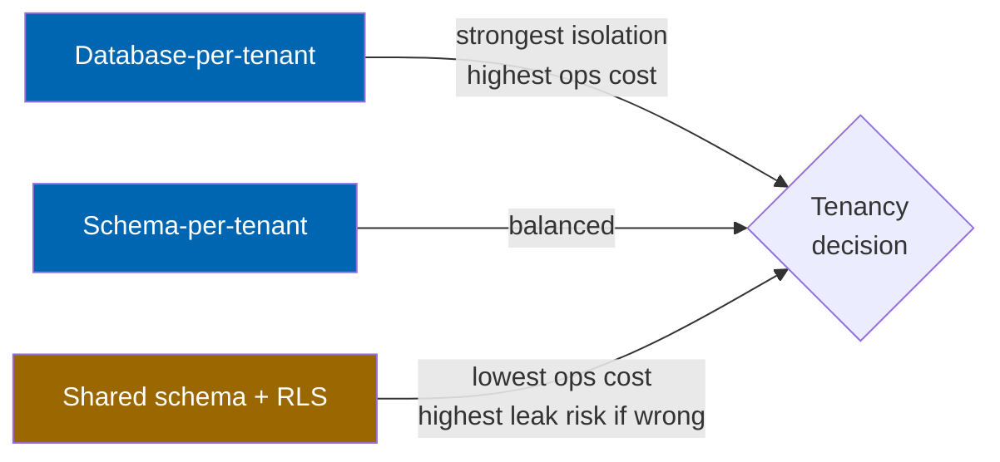
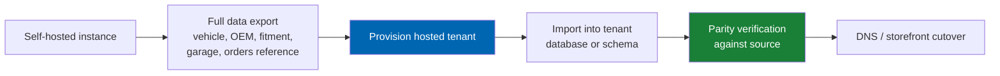
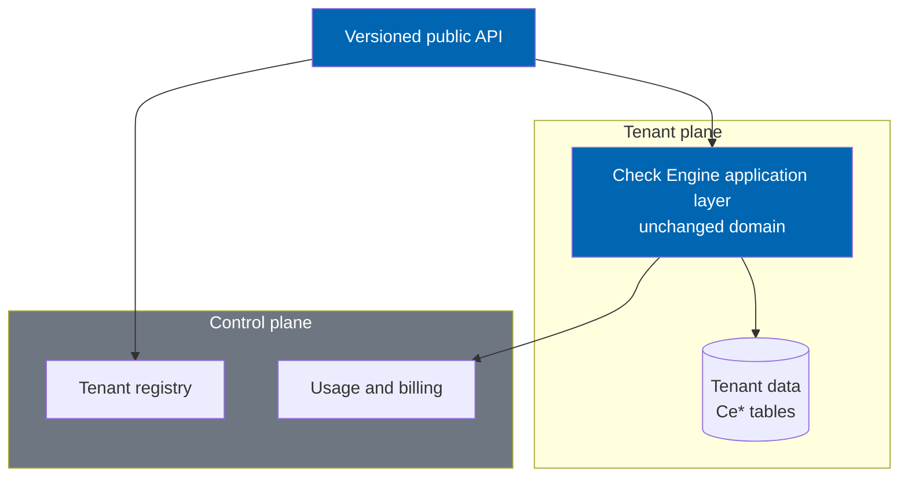

# 49 SaaS Roadmap

> Multi-tenant architecture options, tenant isolation, metered billing, per-tenant configuration,
> vehicle data as a service, public API versioning, the hosted licence model, and the migration path
> from the self-hosted plugin — Horizon 5, gated and not date-committed.

**Status:** Review · **Owner:** Architecture Owner · **Last revised:** 2026-07-28

---

## Contents

- [Executive Summary](#executive-summary)
- [Objectives](#objectives)
- [Scope](#scope)
- [Detailed Specifications](#detailed-specifications)
  - [Why Horizon 5, and why gated](#why-horizon-5-and-why-gated)
  - [Multi-tenant architecture options](#multi-tenant-architecture-options)
  - [Phased recommendation](#phased-recommendation)
  - [Tenant isolation requirements](#tenant-isolation-requirements)
  - [Metered billing](#metered-billing)
  - [Per-tenant configuration](#per-tenant-configuration)
  - [Vehicle data as a service](#vehicle-data-as-a-service)
  - [Public API versioning](#public-api-versioning)
  - [Licence model shift for hosted operation](#licence-model-shift-for-hosted-operation)
  - [Migration path from self-hosted](#migration-path-from-self-hosted)
  - [Schema and platform sketch](#schema-and-platform-sketch)
- [Architecture](#architecture)
- [User Stories](#user-stories)
- [Acceptance Criteria](#acceptance-criteria)
- [Future Enhancements](#future-enhancements)
- [References](#references)

---

## Executive Summary

Horizon 5 (`v2.0+`, `EP-28`) asks whether Check Engine should exist as a **hosted service**, not only as
a self-hosted nopCommerce plugin. This document specifies the architecture options, the isolation and
billing requirements a decision would carry, and the migration path — without committing to build it or
to a ship date. Horizon 5 promotion follows the roadmap's own governance rule: it may move earlier only
once its dependencies are satisfied and its exit criteria are testable
([ROADMAP.md](../ROADMAP.md#roadmap-governance)).

Takeaways:

1. **This document is a decision framework, not a build commitment.** No date appears here; dates are
   made only in [41 Release Plan](41-release-plan.md) and only for externally gated events, per
   [ROADMAP.md](../ROADMAP.md#roadmap-governance).
2. **Two tenancy models are viable; neither is dismissed by default.** Database-per-tenant and
   shared-schema-with-row-level-security (RLS) both meet isolation requirements at different points on
   the cost/complexity curve. A **phased path** — start database-per-tenant, evolve toward shared+RLS
   only once operational data justifies it — is recommended over committing to either extreme up front.
3. **Vehicle data as a service is viable only because the catalog is owned, not licensed** (`ADR-003`).
   A licensed third-party feed could not be redistributed to tenants without renegotiating rights it was
   never granted for resale.
4. **Horizon 1's schema decision already anticipated this.** `10 Database Design` deliberately did not
   scatter a nullable `TenantId` across Horizon 1 tables, reserving the tenancy decision for this
   document rather than pre-committing to a shape that this analysis might reject
   ([10](10-database-design.md#naming-conventions)).
5. **The public API and the hosted offering are coupled but not identical.** A versioned public API is
   listed as Horizon 5 scope in [08 System Architecture](08-system-architecture.md#public-api-surface);
   this document treats it as a prerequisite for both the hosted product and for vehicle data as a
   service, not as SaaS-exclusive work.

---

## Objectives

| # | Objective | Traces to | Measure |
|---|---|---|---|
| 1 | Compare tenancy models against isolation, cost, and operational complexity | `BR-042`, `NFR-043` | Decision matrix complete with a stated recommendation |
| 2 | State tenant isolation requirements testable independent of the chosen model | `FR-1310`–`FR-1313` | Isolation test suite sketch |
| 3 | Specify metered billing primitives without prescribing a specific billing vendor | `FR-1320`–`FR-1322` | Usage-event schema |
| 4 | Establish that vehicle data as a service depends on `ADR-003` and the public API | `ADR-003`, [08](08-system-architecture.md) | Explicit dependency statement |
| 5 | Define the self-hosted → hosted migration path without customer data loss | `FR-1330` | Migration playbook outline |
| 6 | Avoid any date commitment in this document | [ROADMAP.md](../ROADMAP.md#roadmap-governance) | No calendar date appears outside externally gated `ADR-002` references |

---

## Scope

### In scope

- Tenancy architecture options and a phased recommendation
- Tenant isolation requirements at the data, application, and operational layers
- Metered billing concepts and usage-event capture
- Per-tenant configuration model
- Vehicle data as a service dependency chain
- Public API versioning policy at the level this document owns (detail in [08](08-system-architecture.md))
- Hosted licence model implications and the self-hosted migration path

### Out of scope

| Not covered | Where |
|---|---|
| Public API endpoint-level contract design | [08 System Architecture](08-system-architecture.md#public-api-surface) (future revision) |
| Billing vendor selection and payment processing | Commercial decision, [44 Commercial Strategy](44-commercial-strategy.md) |
| .NET 10 retargeting mechanics | [32 Deployment](32-deployment.md#platform-upgrade-track), `ADR-002` |
| Licence tier detail for the self-hosted product | [43 Licensing](43-licensing.md) |
| Workshop, fleet, and dealer portal behaviour | [46](46-workshop-portal.md)–[48](48-dealer-portal.md) — these remain single-tenant, self-hosted features that a hosted tenant would also receive unchanged |
| Committing to a ship date | Explicitly and permanently out of scope for this document |

### Assumptions

- A decision to build Horizon 5 requires product owner and architecture board approval, per the ADR
  process in [CONTRIBUTING.md](../CONTRIBUTING.md#requirement-and-identifier-discipline); nothing in
  this document authorises implementation to begin.
- The self-hosted plugin remains a first-class, permanently supported deployment mode; hosted operation
  is additive, not a replacement (`FR-1331`).
- nopCommerce itself is not natively multi-tenant; any shared-tenancy model operates at the Check Engine
  layer and/or via nopCommerce's existing multi-store mechanism, not by modifying nopCommerce core
  (`ADR-005`, `BR-010`).
- TDD applies to isolation-critical code (tenant resolution middleware, RLS predicate construction, and
  billing usage capture) at the same rigour as fitment and vendor isolation (`ADR-015`).

### Dependencies

[03](03-non-functional-requirements.md), [08](08-system-architecture.md), [09](09-plugin-architecture.md),
[10](10-database-design.md), [19](19-marketplace-module.md), [28](28-security.md), `ADR-002`, `ADR-003`,
`ADR-009`, new Block 1300.

---

## Detailed Specifications

### Why Horizon 5, and why gated

Horizon 5 sits after the marketplace (Horizon 3) and the vertical portals (Horizon 4) for the same
reason the marketplace sits after Horizon 1: **each layer multiplies the cost of getting the layer below
it wrong**. Multi-tenancy compounds every unresolved isolation question from the marketplace vendor work
across an unbounded number of tenants instead of a bounded set of vendors within one operator's
instance. Shipping it early would mean discovering isolation defects at a scale where a single leak is a
multi-customer incident rather than a single-operator one.

`ROADMAP.md` records the gating explicitly: retargeting to .NET 10 is itself gated by nopCommerce's next
major release (`ADR-002`), and Horizon 5 depends on the vertical portals proving the account-type
pattern (workshop, fleet, dealer accounts) that a tenant model would need to generalise
([ROADMAP.md](../ROADMAP.md#horizon-5--platform)).

### Multi-tenant architecture options

| Option | Isolation strength | Operational cost | Cross-tenant query cost | Migration cost per tenant |
|---|---|---|---|---|
| **Database-per-tenant** | Strongest — physical separation | Highest at scale (N databases to patch, back up, monitor) | High (fan-out required) | Low — a tenant is a self-contained unit, closest to today's self-hosted shape |
| **Schema-per-tenant** (shared database, separate schema) | Strong — logical separation, shared engine | Medium | Medium | Medium |
| **Shared schema with row-level security (RLS)** | Depends entirely on correct enforcement — a missing predicate is a cross-tenant leak | Lowest — one schema to operate | Low — reporting and analytics query naturally | Highest to retrofit safely |

None of the three requires a different domain model: the same `TwinParticles.CheckEngine.Domain`
assembly with no nopCommerce or tenancy-framework dependency (`ADR-007`) runs unmodified under any
option, because tenancy is an **infrastructure and data-access concern**, not a domain concern. This is
the same separation of concerns that already keeps the fitment engine portable across nopCommerce major
versions.

### Phased recommendation

Rather than committing to one model at the outset, the recommendation is a **phased path**, consistent
with the roadmap's principle of shipping a coherent, testable state at each step rather than a
big-bang architecture:

| Phase | Model | Rationale |
|---|---|---|
| **5.1 — early hosted pilot** | Database-per-tenant | Reuses the self-hosted schema and isolation reasoning almost unchanged; a tenant's data is physically separable, which materially simplifies the initial security review and the "no cross-tenant leak" proof at low tenant counts |
| **5.2 — scale-driven evolution** | Schema-per-tenant for cost-sensitive tenant tiers, database-per-tenant retained for tenants requiring the strongest contractual isolation guarantee | Avoids operating thousands of databases while preserving an isolation tier for customers who require it |
| **5.3 — shared-schema RLS, evaluated not committed** | Shared schema with RLS, only if tenant volume and cost pressure justify the retrofit, and only after the RLS enforcement path has an automated isolation test suite as rigorous as the marketplace vendor isolation tests (`NFR-043`) | RLS is the cheapest model to run and the most dangerous to get wrong; it is not adopted until the isolation proof bar is met, not on a timeline |

**Explicit non-decision:** this document does not select a phase-5.3 date or commit that phase 5.3 will
ever occur. It is documented as the evolution path a cost-driven future decision could take, per
`ROADMAP.md`'s rule that "any deferred item is recorded with the reason and the earliest horizon it
could re-enter" ([ROADMAP.md](../ROADMAP.md#roadmap-governance)).

### Tenant isolation requirements

Independent of which model above is chosen, the following hold (`FR-1310`):

| Requirement | Detail |
|---|---|
| Data isolation | No tenant's fitment claims, vehicle customisations, orders, customers, or garage data are readable or writable by another tenant, under any query path — the same standard already proven for marketplace vendors (`FR-857`) generalised to tenants |
| Application isolation | Tenant context is resolved once per request (from host, subdomain, or authenticated principal) and flows through the same Application-layer boundary as today's `CustomerId` scoping — no ad hoc tenant checks scattered in views |
| Background job isolation | Scheduled tasks (fitment re-evaluation, ERP sync, AI batch jobs) operate per-tenant and cannot enumerate across tenants by accident (`FR-1311`) |
| Cache isolation | Distributed cache keys are tenant-qualified; a cache key collision across tenants is treated as a security defect, not a performance bug (`FR-1312`) |
| Operational isolation | Diagnostics, support tooling, and log aggregation are tenant-scoped by default; cross-tenant support access requires the same audited elevation pattern as the existing garage support view (`FR-715`) generalised (`FR-1313`) |
| Test requirement | An automated isolation test suite equivalent in rigour to `AC-19.1` (marketplace vendor isolation) is a Horizon 5 exit criterion, not an aspiration |

### Metered billing

| Rule (`FR-1320`) | Detail |
|---|---|
| Usage events | Billable actions (e.g. fitment evaluations, VIN decodes, AI feature calls, storage volume, order count) emit a tenant-scoped usage event, reusing the ledger pattern already established for AI cost governance (`CeAiUsageDaily`, [10](10-database-design.md#ai-review-and-audit)) |
| Aggregation | Daily/monthly rollups per tenant per metric, queryable for both billing and the tenant's own usage dashboard |
| Billing engine boundary (`FR-1321`) | Check Engine emits usage events and exposes them through a port; invoicing and payment capture are delegated to a billing provider adapter, following the same ports-and-adapters discipline as the ERPNext and AI provider integrations (`ADR-007`) — no billing vendor is hardcoded |
| Overage behaviour (`FR-1322`) | Exceeding a metered plan limit degrades gracefully (notification, soft cap, or throttling per plan) and **never silently deletes or corrupts tenant data**, consistent with the existing principle that a commercial or entitlement lapse degrades rather than destroys (`ADR-009`) |

### Per-tenant configuration

| Rule (`FR-1323`) | Detail |
|---|---|
| Scope | Feature flags, AI provider selection, ERPNext connection, ranking weights, publish thresholds, and locale defaults are all per-tenant, reusing the existing Options-pattern configuration surface (`FR-920`) with a tenant key added at the resolution layer, not by forking the settings model |
| Isolation of secrets | Per-tenant secrets (AI keys, ERP credentials) follow the same secret-storage rule as today (`NFR-037`), keyed additionally by tenant |
| Defaults | New tenants provision with safe defaults — AI disabled, conservative publish thresholds — identical in spirit to the self-hosted defaults (`ADR-008`) |

### Vehicle data as a service

`ADR-003` — curating vehicle, OEM, and fitment data in-house rather than licensing a third-party feed —
is what makes this offering legally and commercially possible at all. A licensed feed carries
redistribution restrictions that would prohibit exposing it to hosted tenants as a service; an owned
catalog carries no such restriction.

| Rule (`FR-1330`) | Detail |
|---|---|
| Offering shape | Read access to the curated vehicle hierarchy, OEM registry, and (with appropriate confidence/provenance disclosure) fitment claims, exposed through the versioned public API — not a bulk data dump that defeats confidence and provenance controls |
| Tenant vs data-service consumer | A data-service consumer may or may not also be a full hosted tenant; the two offerings share the same underlying API surface and isolation model but are licensed independently |
| Data integrity | Confidence scoring and provenance travel with every record served, exactly as they do internally (`FR-310`, `FR-311`) — the service does not strip the safeguards that make the data trustworthy |
| Dependency | This offering cannot ship before the public API exists ([08](08-system-architecture.md#public-api-surface)); it is sequenced after, not parallel to, API versioning below |

### Public API versioning

| Rule (`FR-1331`) | Detail |
|---|---|
| Versioning scheme | URL-segment major version (e.g. `/api/v1/...`) with additive-only minor changes within a major version, mirroring the SemVer discipline already used for the product itself ([Keep a Changelog / SemVer](appendix.md#external-bibliography)) |
| Stability window | A published major version is supported for a stated minimum period before removal, announced in [CHANGELOG.md](../CHANGELOG.md) with a migration guide, matching the changelog's existing breaking-change discipline |
| Authentication | OAuth-style token authentication for the public surface, distinct from the host-internal Application service calls used today, per the Horizon 5 note already recorded in [28 Security](28-security.md#future-enhancements) |
| Scope for Horizon 1–4 | No Horizon 1–4 feature is blocked on this; host-internal contracts (as used throughout [12](12-vehicle-database.md), [15](15-fitment-engine.md), and the portals) remain the integration surface until the public API ships |

### Licence model shift for hosted operation

| Topic | Self-hosted (today, `43-licensing.md`) | Hosted (Horizon 5 candidate) |
|---|---|---|
| Unit of licensing | Instance and Store limits (`BR-037`) | Tenant subscription plan, metered where applicable |
| Expiry behaviour | Storefront never interrupted; admin degrades to read-only (`ADR-009`) | Equivalent principle generalised: a tenant's storefront read path should not go dark on a billing failure without a grace period; exact degradation policy is commercial-decision work for [44 Commercial Strategy](44-commercial-strategy.md), not fixed here |
| Data ownership on exit | Operator's own database; export tooling already required (`FR-924`) | Tenant data export must be at least as complete as the self-hosted export, per the migration path below |
| Support model | Tier-based per [43 Licensing](43-licensing.md) | Extends, does not replace, the tiered model — hosted becomes an additional delivery mode of the same commercial tiers where applicable |

This document does not fix the commercial pricing of a hosted tier; it fixes the **product behaviour
constraint** that a hosted licence must not regress the "never interrupts commercial operation"
principle that the self-hosted product already guarantees (`ADR-009`).

### Migration path from self-hosted

| Rule (`FR-1332`) | Detail |
|---|---|
| No forced migration | Self-hosted remains a permanently supported deployment mode (`FR-1331` restated); migration to hosted is opt-in |
| Export completeness | The migration export is a superset of the existing uninstall export requirement (`FR-924`), covering vehicle, OEM, fitment, garage, and configuration data — order history migrates per a separately agreed data-retention scope, since orders may remain of record in the operator's existing ERPNext instance |
| Parity verification | Post-import counts and spot-check fitment evaluation outcomes must match the source instance before cutover is offered as complete |
| Rollback | A migration that fails verification does not decommission the source instance; self-hosted remains authoritative until cutover is confirmed |

### Schema and platform sketch

Conceptual, and explicitly **not** a Horizon 1–4 schema change. `10 Database Design` intentionally left
`TenantId` out of the Horizon 1 baseline for exactly this reason
([10](10-database-design.md#naming-conventions)); the sketch below is what a Horizon 5 build would add,
not what exists today.

| Concern | Database-per-tenant shape | Shared-schema (schema-per-tenant / RLS) shape |
|---|---|---|
| Tenant registry | `CeTenant` in a control-plane database, holding connection routing info | `CeTenant` in the shared database |
| Tenant-scoped tables | Unchanged `Ce*` tables, one full set per tenant database | Every `Ce*` table gains a `TenantId` column and an RLS predicate (shared-schema variants only) |
| Usage ledger | `CeTenantUsageDaily`, control-plane or per-tenant depending on billing architecture | Same, with `TenantId` |
| Configuration | `CeTenantSetting` analogous to today's `CheckEngine.*` settings, tenant-keyed | Same |

The control-plane/tenant-plane split shown here is standard for database-per-tenant SaaS and is
included to make the phased recommendation concrete, not as a final design.

---

## Architecture

The domain layer (`TwinParticles.CheckEngine.Domain`) is drawn identically to the self-hosted diagram in
[08 System Architecture](08-system-architecture.md#architectural-style) because it is unchanged by this
document — tenancy is resolved above it, in the Application and Infrastructure layers.

### Rejected alternatives

| Alternative | Rejected because |
|---|---|
| Commit to shared-schema RLS from day one | Highest leak risk, adopted before the isolation test discipline that would justify the risk exists |
| Commit to database-per-tenant permanently regardless of scale | Operationally unsustainable at high tenant counts; the phased path exists precisely to avoid this dead end |
| Fork the domain layer per tenancy model | Violates `ADR-007`; tenancy is correctly an infrastructure concern, and forking the domain would duplicate fitment logic exactly as portal-specific fitment forks are rejected in [46](46-workshop-portal.md#rejected-alternatives) |
| License a third-party vehicle data feed to accelerate data-as-a-service | Contradicts `ADR-003` and would reintroduce the redistribution restriction that made this offering viable in the first place |
| Commit to a ship date to create urgency | Contradicts [ROADMAP.md](../ROADMAP.md#roadmap-governance); Horizon 5 promotion requires satisfied dependencies and testable exit criteria, not a calendar deadline |

---

## User Stories

| ID | Persona | Story | FR | Points | Priority |
|---|---|---|---|---|---|
| `US-1300` | Architecture owner | Compare tenancy models with a documented recommendation before any implementation vote | `FR-1310` | 8 | Must |
| `US-1301` | Prospective hosted customer | Trust that my data cannot be read by another tenant under any query path | `FR-1310` | 13 | Must |
| `US-1302` | Twin Particles commercial | See per-tenant usage suitable for metered invoicing | `FR-1320`, `FR-1321` | 8 | Should |
| `US-1303` | Self-hosted operator | Migrate to hosted without losing vehicle, OEM, fitment, or garage data | `FR-1332` | 13 | Should |
| `US-1304` | Data-service consumer | Consume vehicle and fitment data via a versioned API with confidence and provenance intact | `FR-1330`, `FR-1331` | 8 | Should |

---

## Acceptance Criteria

**`AC-49.1`** — No date commitment
Given this document, when reviewed, then it contains no calendar ship date for Horizon 5 or any of its
sub-phases, only dependency and exit-criteria statements (`ROADMAP.md` governance).

**`AC-49.2`** — Isolation proof precedes shared-schema adoption
Given the phased recommendation, when phase 5.3 (shared-schema RLS) is proposed for adoption, then an
automated isolation test suite at least as rigorous as `AC-19.1` exists and passes before adoption
(`FR-1310`).

**`AC-49.3`** — Domain layer unchanged
Given any tenancy model chosen, when the domain assembly is inspected, then it contains no tenancy,
billing, or hosting-framework reference (`ADR-007`).

**`AC-49.4`** — Data-as-a-service dependency
Given the vehicle-data-as-a-service offering, when its prerequisites are checked, then `ADR-003` and a
shipped versioned public API are both satisfied before it is offered (`FR-1330`).

**`AC-49.5`** — Self-hosted remains first-class
Given the hosted offering ships, when a self-hosted operator is surveyed, then no self-hosted capability
has been withdrawn or degraded as a consequence (`FR-1331`).

**`AC-49.6`** — Graceful billing degradation
Given a tenant exceeding a metered limit, when the overage policy triggers, then no tenant data is
deleted or corrupted as a result (`FR-1322`, `ADR-009` principle).

---

## Future Enhancements

| Enhancement | Horizon | Notes |
|---|---|---|
| Mobile applications atop the public API | 5+ | [45 Future Roadmap](45-future-roadmap.md); depends on `FR-1331` |
| Additional platform targets beyond nopCommerce | Evaluated, not committed | [45 Future Roadmap](45-future-roadmap.md) |
| Marketplace vendor operation within a hosted tenant | 5+ | Combines [19](19-marketplace-module.md) with tenant isolation; not analysed in this revision |
| Self-service tenant provisioning UI | 5+ | Depends on control-plane design maturing beyond the sketch here |

---

## References

- [ROADMAP.md](../ROADMAP.md#horizon-5--platform) — `v2.0+`, governance, and the .NET 10 milestone
- [08 System Architecture](08-system-architecture.md) — public API surface, layering
- [09 Plugin Architecture](09-plugin-architecture.md)
- [10 Database Design](10-database-design.md) — reserved tenancy decision
- [19 Marketplace Module](19-marketplace-module.md) — isolation precedent
- [28 Security](28-security.md) — OWASP mapping, future public API OAuth note
- [43 Licensing](43-licensing.md) — self-hosted tier model this document extends
- [44 Commercial Strategy](44-commercial-strategy.md) — hosted pricing and packaging (commercial decision)
- [46 Workshop Portal](46-workshop-portal.md) · [47 Fleet Portal](47-fleet-portal.md) · [48 Dealer Portal](48-dealer-portal.md) — account-type pattern this document generalises
- [Appendix](appendix.md) — `ADR-002`, `ADR-003`, `ADR-009`, external bibliography
- [01 Business Requirements](01-business-requirements.md) — `BR-010`, `BR-037`–`BR-042`
