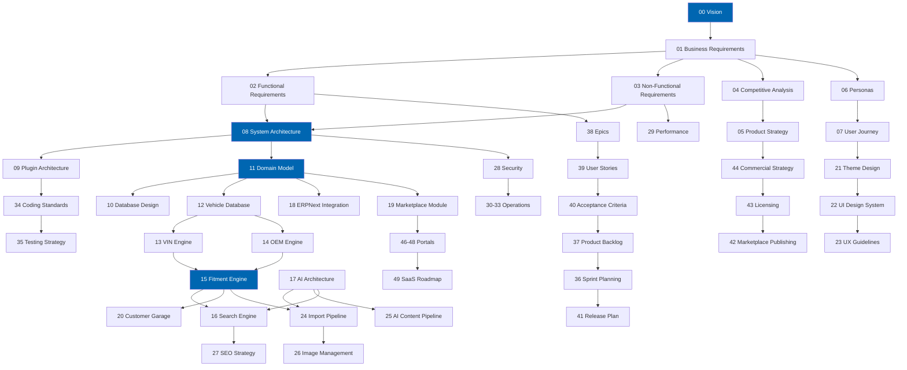

# Check Engine™ Documentation Index

> The annotated index to the Check Engine specification set. Fifty documents, organised by track, with
> the purpose and dependencies of each.

**Product:** Check Engine™ by Twin Particles · **Platform:** nopCommerce 4.90.6 on .NET 9
**Baseline:** 0.1.0 · **Last revised:** 2026-07-28

Start at [README.md](../README.md) for the product overview, or pick a
[reading path](#reading-paths) for your role.

---

## Contents

- [How this set is organised](#how-this-set-is-organised)
- [Document status](#document-status)
- [Track 1 — Product foundation](#track-1--product-foundation)
- [Track 2 — Strategy and commercial](#track-2--strategy-and-commercial)
- [Track 3 — Experience](#track-3--experience)
- [Track 4 — Architecture](#track-4--architecture)
- [Track 5 — Automotive core](#track-5--automotive-core)
- [Track 6 — Data and AI](#track-6--data-and-ai)
- [Track 7 — Integration and operations](#track-7--integration-and-operations)
- [Track 8 — Delivery and future](#track-8--delivery-and-future)
- [Reading paths](#reading-paths)
- [Dependency graph](#dependency-graph)
- [Conventions](#conventions)
- [Filename mapping](#filename-mapping)

---

## How this set is organised

Fifty documents in eight tracks. Numbering follows the original specification order; **tracks group
documents by concern**, which is why a track's numbers are not always contiguous. The numbering is
stable and never changes — see [CONTRIBUTING.md](../CONTRIBUTING.md#requirement-and-identifier-discipline).

Every document follows the same section template — Executive Summary, Objectives, Scope, Detailed
Specifications, Architecture, User Stories, Acceptance Criteria, Future Enhancements, References — so
that information is where you expect it. The template is defined in
[CONTRIBUTING.md](../CONTRIBUTING.md#document-template).

---

## Document status

| Status | Meaning |
|---|---|
| **Approved** | Signed off. Changes require product owner approval and a changelog entry |
| **Review** | Content complete, awaiting sign-off |
| **Draft** | Being written |
| **Planned** | Not yet started. Scheduled in a [ROADMAP.md](../ROADMAP.md#documentation-phases) phase |

Progress by phase is tracked in [ROADMAP.md](../ROADMAP.md#documentation-phases) and each phase's
completion is recorded in [CHANGELOG.md](../CHANGELOG.md).

---

## Track 1 — Product foundation

The requirement baseline. Every other document depends on this track, and nothing here may be changed
without a traceability review.

| # | Document | Purpose | Status | Phase |
|---|---|---|---|---|
| 00 | [Vision](00-vision.md) | The problem thesis, the product's reason to exist, positioning, the brand-agnostic principle, and how success is measured | Review | 1 |
| 01 | [Business Requirements](01-business-requirements.md) | 42 business requirements `BR-001`–`BR-042`, the revenue model, stakeholder map, constraints, assumptions, and the risk register `RISK-01`–`RISK-14` | Review | 1 |
| 02 | [Functional Requirements](02-functional-requirements.md) | 214 functional requirements across nine module blocks, `FR-101`–`FR-914`, each traced to a business requirement | Review | 1 |
| 03 | [Non-Functional Requirements](03-non-functional-requirements.md) | 68 requirements `NFR-001`–`NFR-068` for performance, scalability, availability, security, accessibility, localisation, and maintainability, each with a measurement method | Review | 1 |

---

## Track 2 — Strategy and commercial

Why this product wins, who buys it, and how it is sold and licensed.

| # | Document | Purpose | Status | Phase |
|---|---|---|---|---|
| 04 | [Competitive Analysis](04-competitive-analysis.md) | Eleven competing approaches across four categories, feature and pricing matrices, and the defensibility analysis | Review | 1 |
| 05 | [Product Strategy](05-product-strategy.md) | Positioning, the market-agnostic regional provider strategy, segment prioritisation, moat construction, and the build-versus-license decision | Review | 1 |
| 44 | [Commercial Strategy](44-commercial-strategy.md) | Pricing, packaging, partner programme, sales motion, and unit economics | Review | 8 |
| 42 | [Marketplace Publishing](42-marketplace-publishing.md) | nopCommerce Marketplace submission, listing assets, review criteria, and the update process | Review | 8 |
| 43 | [Licensing](43-licensing.md) | Licence tiers, activation mechanism, entitlement enforcement, support lifecycle, end-of-life policy, and the trademark compliance posture | Review | 8 |

---

## Track 3 — Experience

Who uses the product, what they are trying to do, and how it looks and behaves.

| # | Document | Purpose | Status | Phase |
|---|---|---|---|---|
| 06 | [Personas](06-personas.md) | Eleven personas across four classes — end customer, trade buyer, operator, administrator — with goals, frustrations, technical context, and the requirements each drives | Review | 1 |
| 07 | [User Journey](07-user-journey.md) | Fourteen end-to-end journeys with stage maps, emotional arcs, failure modes, instrumentation points, and success criteria | Review | 1 |
| 21 | [Theme Design](21-theme-design.md) | The premium dark automotive theme: layout system, mega menu, garage widget, vehicle selector, sticky search, product page, and landing page templates | Review | 6 |
| 22 | [UI Design System](22-ui-design-system.md) | Design tokens, typography, colour, spacing, component library, states, and the Arabic type strategy | Review | 6 |
| 23 | [UX Guidelines](23-ux-guidelines.md) | Interaction principles, bidirectional layout, accessibility to WCAG 2.2 AA, error and empty states, and progressive disclosure | Review | 6 |
| 27 | [SEO Strategy](27-seo-strategy.md) | Vehicle and part landing pages, structured data, URL architecture, internationalisation with hreflang, and Core Web Vitals as a ranking input | Review | 6 |

---

## Track 4 — Architecture

How the product is structured. **Phase 2 requires sign-off before later phases proceed**, because every
subsequent document cross-references the domain model and the schema conventions established here.

| # | Document | Purpose | Status | Phase |
|---|---|---|---|---|
| 08 | [System Architecture](08-system-architecture.md) | Layering, dependency rules, module boundaries, cross-cutting concerns, deployment topology, and the public API surface | Review | 2 |
| 09 | [Plugin Architecture](09-plugin-architecture.md) | nopCommerce extension points, project and folder structure, DI registration, migrations, routing, widgets, event consumers, assembly and dependency management, and the install and uninstall lifecycle | Review | 2 |
| 10 | [Database Design](10-database-design.md) | The entity-relationship model, table specifications, indexes, constraints, naming conventions, and the migration strategy | Review | 2 |
| 11 | [Domain Model](11-domain-model.md) | Aggregates, entities, value objects, domain services, invariants, specifications, and domain events | Review | 2 |
| 34 | [Coding Standards](34-coding-standards.md) | Test-Driven Development, C# conventions, Clean Architecture and SOLID application, CQRS boundaries, async discipline, the Options pattern, error handling, and the analyser configuration | Review | 2 |

---

## Track 5 — Automotive core

The differentiating engines. This track is the product.

| # | Document | Purpose | Status | Phase |
|---|---|---|---|---|
| 12 | [Vehicle Database](12-vehicle-database.md) | The make → model → generation → body → engine → trim hierarchy, curation methodology, data quality controls, and the brand-agnostic schema | Review | 3 |
| 13 | [VIN Engine](13-vin-engine.md) | The 17-character standard, WMI and VDS and VIS handling, check-digit validation, per-manufacturer decoder plugins, the confidence model, and graceful failure | Review | 3 |
| 14 | [OEM Engine](14-oem-engine.md) | Part number registry, normalisation rules, cross-references, aftermarket equivalence, supersession chains, and manufacturer qualification | Review | 3 |
| 15 | [Fitment Engine](15-fitment-engine.md) | The applicability model, qualifiers, production date windows, confidence scoring, provenance, evaluation algorithm, caching, and the human review workflow | Review | 3 |
| 16 | [Search Engine](16-search-engine.md) | Six search modes over one unified query contract, indexing strategy, ranking, faceting, the Arabic-English bilingual index, and performance budgets | Review | 3 |
| 20 | [Customer Garage](20-customer-garage.md) | Saved vehicles, VINs, and OEM numbers, guest-to-account migration, cross-device persistence, and garage-scoped browsing | Review | 5 |

---

## Track 6 — Data and AI

How the catalog is acquired and enriched, and how AI is used without letting it publish unsupervised.

| # | Document | Purpose | Status | Phase |
|---|---|---|---|---|
| 17 | [AI Architecture](17-ai-architecture.md) | Provider abstraction across OpenAI, Azure OpenAI, and Anthropic; prompt management and versioning; token accounting and spend ceilings; caching; graceful degradation; and the per-feature data disclosure inventory | Review | 4 |
| 24 | [Product Import Pipeline](24-product-import-pipeline.md) | Twelve-stage ingestion from PDF, Excel, and CSV: extraction, normalisation, duplicate detection, OEM matching, vehicle matching, enrichment, translation, SEO generation, categorisation, image assignment, review, and publication | Review | 4 |
| 25 | [AI Content Pipeline](25-ai-content-pipeline.md) | Description and specification generation, bilingual translation with an enforced automotive glossary, SEO metadata, quality scoring, and the mandatory review workflow | Review | 4 |
| 26 | [Image Management](26-image-management.md) | Sourcing, storage, derivative generation, CDN delivery, placeholder strategy, and the professional replacement workflow | Review | 4 |

---

## Track 7 — Integration and operations

Connecting to other systems, and running the product in production.

| # | Document | Purpose | Status | Phase |
|---|---|---|---|---|
| 18 | [ERPNext Integration](18-erpnext-integration.md) | Bi-directional synchronisation of products, inventory, customers, orders, invoices, returns, shipments, and CRM; conflict resolution; retry and idempotency; and the reconciliation model | Review | 5 |
| 19 | [Marketplace Module](19-marketplace-module.md) | Supplier onboarding, catalog isolation, vendor dashboards, commission models, payouts, multi-vendor cart and split orders, and vendor-contributed fitment | Review | 5 |
| 28 | [Security](28-security.md) | Authentication, authorisation and the permission model, audit logging, OWASP Top Ten controls, rate limiting, secrets management, data protection, and vulnerability disclosure | Review | 7 |
| 29 | [Performance](29-performance.md) | Performance budgets, the reference dataset, caching architecture, query optimisation, Core Web Vitals, and load testing methodology | Review | 7 |
| 30 | [Analytics](30-analytics.md) | Product and commercial metrics, event taxonomy, funnel instrumentation, fitment accuracy measurement, and operator dashboards | Review | 7 |
| 31 | [Logging](31-logging.md) | Structured logging, log levels, correlation identifiers, retention, sensitive-data redaction, and observability integration | Review | 7 |
| 32 | [Deployment](32-deployment.md) | The platform upgrade track from 4.60 to 4.90, environment topology, installation, upgrade and rollback procedures, web farm operation, and containerisation | Review | 7 |
| 33 | [CI-CD](33-ci-cd.md) | GitHub Actions pipelines, the build and test matrix, automated quality gates, traceability validation, packaging, signing, and release automation | Review | 7 |
| 35 | [Testing Strategy](35-testing-strategy.md) | Test categories, coverage thresholds, the fitment accuracy test corpus, integration fixtures, performance testing, and manual verification protocols | Review | 7 |

---

## Track 8 — Delivery and future

The execution plan and the product's evolution.

| # | Document | Purpose | Status | Phase |
|---|---|---|---|---|
| 36 | [Sprint Planning](36-sprint-planning.md) | Sprint decomposition, capacity model, dependency sequencing, and the platform upgrade prerequisite track | Review | 8 |
| 37 | [Product Backlog](37-product-backlog.md) | The full ordered backlog with priorities, story points, dependencies, and horizon assignment | Review | 8 |
| 38 | [Epics](38-epics.md) | Epic inventory `EP-01`–`EP-28`, each mapped to business requirements and roadmap horizons | Review | 8 |
| 39 | [User Stories](39-user-stories.md) | The complete story inventory `US-001`–`US-120`, with persona, value statement, points, and priority | Review | 8 |
| 40 | [Acceptance Criteria](40-acceptance-criteria.md) | Given/When/Then criteria `AC-nnn.n` for every story, traced to tests | Review | 8 |
| 41 | [Release Plan](41-release-plan.md) | Release cadence, gating criteria, the .NET 10 milestone, beta programme, and go-to-market sequencing | Review | 8 |
| 45 | [Future Roadmap](45-future-roadmap.md) | Beyond Horizon 5: additional platforms, mobile, data services, and evaluated-but-rejected directions | Review | 8 |
| 46 | [Workshop Portal](46-workshop-portal.md) | Job-based ordering, labour estimates, customer vehicle records, trade pricing, and parts-to-job allocation | Review | 8 |
| 47 | [Fleet Portal](47-fleet-portal.md) | Bulk vehicle registers, maintenance forecasting, consumption analytics, cost-per-vehicle reporting, and approval workflows | Review | 8 |
| 48 | [Dealer Portal](48-dealer-portal.md) | Franchise-aware catalogs, allocation and quota management, tiered pricing, and warranty claim support | Review | 8 |
| 49 | [SaaS Roadmap](49-saas-roadmap.md) | Multi-tenant architecture, tenant isolation, metered billing, and vehicle data as a service | Review | 8 |
| — | [Appendix](appendix.md) | Glossary, the automotive controlled vocabulary, architecture decision records, and the external reference bibliography | Review | 8 |

---

## Reading paths

| Role | Path |
|---|---|
| **Executive, investor** | [00](00-vision.md) → [04](04-competitive-analysis.md) → [05](05-product-strategy.md) → [44](44-commercial-strategy.md) → [41](41-release-plan.md) |
| **Product manager** | [00](00-vision.md) → [01](01-business-requirements.md) → [02](02-functional-requirements.md) → [06](06-personas.md) → [07](07-user-journey.md) → [37](37-product-backlog.md) |
| **Solution architect** | [08](08-system-architecture.md) → [09](09-plugin-architecture.md) → [11](11-domain-model.md) → [10](10-database-design.md) → [03](03-non-functional-requirements.md) |
| **Backend engineer** | [09](09-plugin-architecture.md) → [34](34-coding-standards.md) → [11](11-domain-model.md) → [15](15-fitment-engine.md) → [35](35-testing-strategy.md) |
| **Frontend engineer** | [21](21-theme-design.md) → [22](22-ui-design-system.md) → [23](23-ux-guidelines.md) → [29](29-performance.md) |
| **Data engineer** | [24](24-product-import-pipeline.md) → [25](25-ai-content-pipeline.md) → [12](12-vehicle-database.md) → [14](14-oem-engine.md) |
| **AI engineer** | [17](17-ai-architecture.md) → [25](25-ai-content-pipeline.md) → [16](16-search-engine.md) → [15](15-fitment-engine.md) |
| **DevOps engineer** | [32](32-deployment.md) → [33](33-ci-cd.md) → [31](31-logging.md) → [29](29-performance.md) |
| **QA engineer** | [35](35-testing-strategy.md) → [40](40-acceptance-criteria.md) → [02](02-functional-requirements.md) → [03](03-non-functional-requirements.md) |
| **Security reviewer** | [28](28-security.md) → [08](08-system-architecture.md) → [09](09-plugin-architecture.md) → [17](17-ai-architecture.md) → [LICENSE](../LICENSE.md) |
| **Automotive domain expert** | [12](12-vehicle-database.md) → [13](13-vin-engine.md) → [14](14-oem-engine.md) → [15](15-fitment-engine.md) → [Appendix](appendix.md) |
| **Implementation partner** | [00](00-vision.md) → [02](02-functional-requirements.md) → [09](09-plugin-architecture.md) → [32](32-deployment.md) → [43](43-licensing.md) |

---

## Dependency graph

Which documents depend on which. An arrow means "cannot be written or understood without". This is why
the phases in [ROADMAP.md](../ROADMAP.md#documentation-phases) are sequential.

The fitment engine sits at the centre of the graph. That is not an accident of drawing — it is the
structural reason the product exists, and the reason it cannot be built last.

---

## Conventions

Full detail in [CONTRIBUTING.md](../CONTRIBUTING.md). Summary for readers:

### Identifiers

| Prefix | Meaning | Defined in |
|---|---|---|
| `BR-nnn` | Business requirement | [01](01-business-requirements.md) |
| `FR-nnn` | Functional requirement | [02](02-functional-requirements.md) |
| `NFR-nnn` | Non-functional requirement | [03](03-non-functional-requirements.md) |
| `EP-nn` | Epic | [38](38-epics.md) |
| `US-nnn` | User story | [39](39-user-stories.md) |
| `AC-nnn.n` | Acceptance criterion | [40](40-acceptance-criteria.md) |
| `RISK-nn` | Tracked risk | [01](01-business-requirements.md) |
| `ADR-nnn` | Architecture decision record | [Appendix](appendix.md) |

Functional requirement blocks: **100s** vehicle · **200s** VIN and OEM · **300s** fitment · **400s**
search · **500s** AI · **600s** catalog and import · **700s** garage and customer · **800s**
marketplace and ERP · **900s** administration and platform.

Identifiers are permanent. Withdrawn items keep their number and are marked `WITHDRAWN`.

### Diagrams

Mermaid, rendered by GitHub. Fixed palette: primary `#0066B1` for Check Engine components, success
`#1a7f37`, warning `#9a6700`, danger `#cf222e`, neutral `#6e7781` for external systems. Standards in
[CONTRIBUTING.md](../CONTRIBUTING.md#mermaid-diagram-standards).

### Language

British English. Complete sentences. Tables for enumerable facts, prose for reasoning. No placeholders,
no `TODO`, no `TBD` — an undecided question is recorded explicitly with its decision owner.

---

## Filename mapping

The document set was specified with space-separated filenames such as `00 Vision.md`. Files are created
in lowercase kebab-case — `00-vision.md` — because filenames containing spaces require percent-encoding
in Markdown links, break shell tooling without quoting, and are mishandled by several static site
generators. Numbering and titles are otherwise unchanged. Recorded as `ADR-010` in
[CHANGELOG.md](../CHANGELOG.md#decisions).

| Specified | Created |
|---|---|
| `00 Vision.md` | [`00-vision.md`](00-vision.md) |
| `01 Business Requirements.md` | [`01-business-requirements.md`](01-business-requirements.md) |
| `02 Functional Requirements.md` | [`02-functional-requirements.md`](02-functional-requirements.md) |
| `03 Non Functional Requirements.md` | [`03-non-functional-requirements.md`](03-non-functional-requirements.md) |
| `04 Competitive Analysis.md` | [`04-competitive-analysis.md`](04-competitive-analysis.md) |
| `05 Product Strategy.md` | [`05-product-strategy.md`](05-product-strategy.md) |
| `06 Personas.md` | [`06-personas.md`](06-personas.md) |
| `07 User Journey.md` | [`07-user-journey.md`](07-user-journey.md) |
| `08 System Architecture.md` | [`08-system-architecture.md`](08-system-architecture.md) |
| `09 Plugin Architecture.md` | [`09-plugin-architecture.md`](09-plugin-architecture.md) |
| `10 Database Design.md` | [`10-database-design.md`](10-database-design.md) |
| `11 Domain Model.md` | [`11-domain-model.md`](11-domain-model.md) |
| `12 Vehicle Database.md` | [`12-vehicle-database.md`](12-vehicle-database.md) |
| `13 VIN Engine.md` | [`13-vin-engine.md`](13-vin-engine.md) |
| `14 OEM Engine.md` | [`14-oem-engine.md`](14-oem-engine.md) |
| `15 Fitment Engine.md` | [`15-fitment-engine.md`](15-fitment-engine.md) |
| `16 Search Engine.md` | [`16-search-engine.md`](16-search-engine.md) |
| `17 AI Architecture.md` | [`17-ai-architecture.md`](17-ai-architecture.md) |
| `18 ERPNext Integration.md` | [`18-erpnext-integration.md`](18-erpnext-integration.md) |
| `19 Marketplace Module.md` | [`19-marketplace-module.md`](19-marketplace-module.md) |
| `20 Customer Garage.md` | [`20-customer-garage.md`](20-customer-garage.md) |
| `21 Theme Design.md` | [`21-theme-design.md`](21-theme-design.md) |
| `22 UI Design System.md` | [`22-ui-design-system.md`](22-ui-design-system.md) |
| `23 UX Guidelines.md` | [`23-ux-guidelines.md`](23-ux-guidelines.md) |
| `24 Product Import Pipeline.md` | [`24-product-import-pipeline.md`](24-product-import-pipeline.md) |
| `25 AI Content Pipeline.md` | [`25-ai-content-pipeline.md`](25-ai-content-pipeline.md) |
| `26 Image Management.md` | [`26-image-management.md`](26-image-management.md) |
| `27 SEO Strategy.md` | [`27-seo-strategy.md`](27-seo-strategy.md) |
| `28 Security.md` | [`28-security.md`](28-security.md) |
| `29 Performance.md` | [`29-performance.md`](29-performance.md) |
| `30 Analytics.md` | [`30-analytics.md`](30-analytics.md) |
| `31 Logging.md` | [`31-logging.md`](31-logging.md) |
| `32 Deployment.md` | [`32-deployment.md`](32-deployment.md) |
| `33 CI-CD.md` | [`33-ci-cd.md`](33-ci-cd.md) |
| `34 Coding Standards.md` | [`34-coding-standards.md`](34-coding-standards.md) |
| `35 Testing Strategy.md` | [`35-testing-strategy.md`](35-testing-strategy.md) |
| `36 Sprint Planning.md` | [`36-sprint-planning.md`](36-sprint-planning.md) |
| `37 Product Backlog.md` | [`37-product-backlog.md`](37-product-backlog.md) |
| `38 Epics.md` | [`38-epics.md`](38-epics.md) |
| `39 User Stories.md` | [`39-user-stories.md`](39-user-stories.md) |
| `40 Acceptance Criteria.md` | [`40-acceptance-criteria.md`](40-acceptance-criteria.md) |
| `41 Release Plan.md` | [`41-release-plan.md`](41-release-plan.md) |
| `42 Marketplace Publishing.md` | [`42-marketplace-publishing.md`](42-marketplace-publishing.md) |
| `43 Licensing.md` | [`43-licensing.md`](43-licensing.md) |
| `44 Commercial Strategy.md` | [`44-commercial-strategy.md`](44-commercial-strategy.md) |
| `45 Future Roadmap.md` | [`45-future-roadmap.md`](45-future-roadmap.md) |
| `46 Workshop Portal.md` | [`46-workshop-portal.md`](46-workshop-portal.md) |
| `47 Fleet Portal.md` | [`47-fleet-portal.md`](47-fleet-portal.md) |
| `48 Dealer Portal.md` | [`48-dealer-portal.md`](48-dealer-portal.md) |
| `49 SaaS Roadmap.md` | [`49-saas-roadmap.md`](49-saas-roadmap.md) |
| `Appendix.md` | [`appendix.md`](appendix.md) |

---

## References

- [README.md](../README.md) — product overview
- [LICENSE.md](../LICENSE.md) — commercial licence and documentation licence
- [CHANGELOG.md](../CHANGELOG.md) — revision history and decision records
- [ROADMAP.md](../ROADMAP.md) — delivery horizons and documentation phases
- [CONTRIBUTING.md](../CONTRIBUTING.md) — conventions, template, and review process
