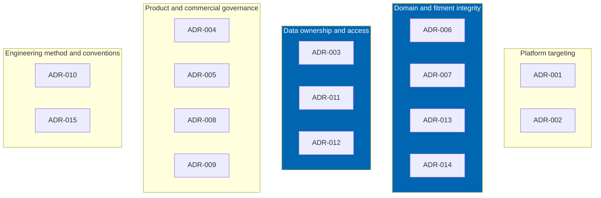
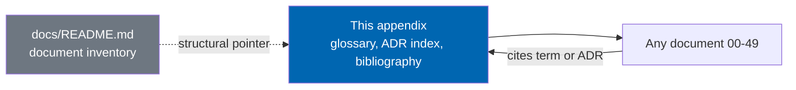

# Appendix

> Glossary of automotive and product terms, the automotive controlled vocabulary governance note, the
> complete architecture decision record index, the external bibliography, the identifier prefix legend,
> and a pointer to the document set inventory.

**Status:** Review · **Owner:** Domain Architect · **Last revised:** 2026-07-28

---

## Contents

- [Executive Summary](#executive-summary)
- [Objectives](#objectives)
- [Scope](#scope)
- [Detailed Specifications](#detailed-specifications)
  - [Glossary](#glossary)
  - [Automotive controlled vocabulary](#automotive-controlled-vocabulary)
  - [Architecture decision record index](#architecture-decision-record-index)
  - [Identifier prefix legend](#identifier-prefix-legend)
  - [Document set inventory](#document-set-inventory)
- [Architecture](#architecture)
- [User Stories](#user-stories)
- [Acceptance Criteria](#acceptance-criteria)
- [Future Enhancements](#future-enhancements)
- [External bibliography](#external-bibliography)
- [References](#references)

---

## Executive Summary

This is the reference document every other Check Engine document points to rather than restates. It
holds four things that belong in exactly one place: the **glossary** a reader unfamiliar with either
automotive parts terminology or this codebase's conventions needs; the **governance note** for the
bilingual controlled vocabulary that keeps part names honest across Arabic and English (`BR-030`); the
**complete architecture decision record index**, `ADR-001` through `ADR-015`, each a one-line pointer
back to its full rationale in [CHANGELOG.md](../CHANGELOG.md); and the **external bibliography** —
every standard, framework document, and policy this specification set cites.

Takeaways:

1. **This document does not introduce new product requirements.** Every `FR`, `NFR`, and `ADR` cited
   here is defined in its owning document; this appendix indexes and defines terms, it does not decide.
2. **The glossary is normative for terminology, not for behaviour.** If a glossary definition and a
   module document's specification appear to disagree, the module document governs and the glossary
   entry is a documentation defect to be corrected.
3. **Fifteen ADRs are recorded to date** (`ADR-001`–`ADR-015`), spanning platform targeting, data
   ownership, brand-agnostic design, AI governance, licensing behaviour, and engineering method. No
   ADR has been superseded or withdrawn as of this revision.
4. **The controlled vocabulary is a governance process, not a static list** — this document describes
   who owns it and how a term is added or changed; the term data itself lives in the product's
   configurable vocabulary tables (`FR-940`, `FR-941`), not in this Markdown file.

---

## Objectives

| # | Objective | Traces to | Measure |
|---|---|---|---|
| 1 | Define every domain and product term used elsewhere without local re-definition | [CONTRIBUTING.md](../CONTRIBUTING.md#documentation-contributions) rule 4 | No other document re-defines a term listed here |
| 2 | Record the complete ADR index with rationale pointers | [CHANGELOG.md](../CHANGELOG.md#decisions) | `ADR-001`–`ADR-015` all present |
| 3 | State the controlled-vocabulary governance model | `BR-030`, `FR-940`, `FR-941` | Governance table complete |
| 4 | Provide a checkable external bibliography | [CONTRIBUTING.md](../CONTRIBUTING.md#documentation-contributions) rule 3 | Every external claim elsewhere traces to an entry here |
| 5 | Give every identifier prefix used across the document set a single defining table | [docs/README.md](README.md#conventions) | Legend matches actual usage across documents 00–49 |

---

## Scope

### In scope

- Glossary of automotive and Check Engine product terminology
- Governance description for the bilingual automotive controlled vocabulary
- Complete `ADR-001`–`ADR-015` index with one-line summaries
- External standards and reference bibliography
- Identifier prefix legend
- Pointer to the full document set inventory

### Out of scope

| Not covered | Where |
|---|---|
| The vocabulary term data itself (part names, translations) | Product configuration, per `FR-940`/`FR-941` |
| Full ADR rationale text | [CHANGELOG.md](../CHANGELOG.md#decisions) — this document indexes, the changelog is the record of truth |
| The document index with per-document purpose and status | [docs/README.md](README.md) |
| Requirement definitions themselves | [01](01-business-requirements.md), [02](02-functional-requirements.md), [03](03-non-functional-requirements.md) |

### Assumptions

- Terms are defined once here in English; Arabic equivalents for customer-facing vocabulary are governed
  by the process in [Automotive controlled vocabulary](#automotive-controlled-vocabulary), not
  duplicated in this appendix.
- New ADRs are appended to [CHANGELOG.md](../CHANGELOG.md#decisions) as they are made and then indexed
  here in the same revision or the next.

### Dependencies

Every document in the set, since this is the shared reference. Most directly:
[01](01-business-requirements.md), [10](10-database-design.md), [12](12-vehicle-database.md)–[15](15-fitment-engine.md),
[CHANGELOG.md](../CHANGELOG.md), [docs/README.md](README.md), [CONTRIBUTING.md](../CONTRIBUTING.md).

---

## Detailed Specifications

### Glossary

Alphabetical. Terms marked **(product)** are Check Engine-specific; unmarked terms are general
automotive or industry terminology.

| Term | Definition |
|---|---|
| **Aftermarket** | A part manufactured by a company other than the original vehicle or original part manufacturer, offered as a functional (and, where labelled, equivalent) alternative to an OEM part. Always labelled as aftermarket in customer-facing UI (`FR-904`). |
| **Confidence (product)** | A `0.00`–`1.00` score attached to a fitment claim or a VIN decode result, expressing the system's certainty in that claim independent of whether it is published. Never a substitute for provenance. See [15](15-fitment-engine.md#confidence-and-provenance). |
| **Configuration (product)** | Short for **Vehicle Configuration** — the leaf node of the vehicle hierarchy (Make → Model → Generation → optional Engine/BodyStyle/Market/Trim) that fitment claims, garage entries, and search context bind to. See [12](12-vehicle-database.md#vehicle-configuration). |
| **Fingerprint (product)** | A hash of a vehicle configuration's distinguishing attributes, used to guarantee global uniqueness of a configuration row (`INV-004`). |
| **Fitment claim (product)** | A structured, provenanced assertion that a specific product applies (or does not apply) to a specific vehicle configuration, optionally qualified by production date, steering side, market, drive type, transmission, or option codes. The central domain concept of the product (`ADR-006`). See [15](15-fitment-engine.md#claim-model). |
| **Garage (product)** | A customer's persistent set of saved vehicles, VINs, and OEM numbers, with at most one active vehicle driving fitment-filtered browsing. See [20](20-customer-garage.md). |
| **Generation** | A distinct engineering platform of a model, typically identified by an internal manufacturer code (e.g. `F30` for a BMW 3 Series generation), used because it is more precise for fitment than model year alone. |
| **Nominative use / nominative fair use** | The legal doctrine permitting reference to a trademark to identify the trademarked thing itself (e.g. naming a manufacturer to state that a part fits its vehicles) without implying endorsement or affiliation. Governs how manufacturer names and marks appear throughout the product. See [LICENSE.md § 10](../LICENSE.md#10-trademarks-and-nominative-use). |
| **OEM (Original Equipment Manufacturer)** | In parts terminology, either (a) the vehicle manufacturer that originally specified a part, or (b) the genuine part itself as opposed to an aftermarket equivalent. Check Engine's OEM engine treats OEM numbers as manufacturer-qualified identifiers, never globally unique in isolation. See [14](14-oem-engine.md). |
| **Production date window** | The inclusive date range during which a specific vehicle configuration or a specific fitment claim is valid, used to express mid-generation changes such as facelifts. A first-class fitment qualifier, not a note (`FR-305`, `FR-306`). |
| **Provenance (product)** | The recorded source, reference, creator, and timestamps behind a fitment claim or an imported record, making every claim auditable and correctable. See [15](15-fitment-engine.md#confidence-and-provenance). |
| **Qualifier (product)** | A structured constraint on a fitment claim — production date window, steering side, market region, drive type, transmission type, or option codes — that narrows when the claim applies. See [15](15-fitment-engine.md#qualifiers). |
| **Safety-critical (product)** | A fitment claim category (braking, steering, suspension, restraints/airbags by default) subject to a hard publication stop: no configuration permits an automatic below-threshold publish for these categories. See [15](15-fitment-engine.md#safety-critical-hard-stop). |
| **Supersession** | A directed, transitive relationship in which one OEM number replaces another as the manufacturer's current part reference. If A supersedes B and B supersedes C, a request for C surfaces A; the relationship is never treated as bidirectional. See [14](14-oem-engine.md#supersession). |
| **VDS (Vehicle Descriptor Section)** | Characters 4–9 of a 17-character VIN, encoding vehicle attributes in a manufacturer-specific scheme that Check Engine interprets via pluggable per-manufacturer decoders. See [13](13-vin-engine.md). |
| **VIN (Vehicle Identification Number)** | The 17-character identifier standardised by ISO 3779, comprising the WMI, VDS, and VIS. Only the three-character WMI position, the check-digit position, and the overall 17-character length are standardised; all other position meaning is manufacturer-specific. See [13](13-vin-engine.md) and [ISO 3779](#external-bibliography). |
| **VIS (Vehicle Identifier Section)** | Characters 10–17 of a 17-character VIN, typically encoding model year, plant code, and a sequential production number. |
| **WMI (World Manufacturer Identifier)** | The first three characters of a VIN, identifying the manufacturer (and, in some schemes, the country/region of manufacture). Stored in `CeVinWmi` ([10](10-database-design.md#vin-support-tables)). |

Terms specific to the Horizon 4/5 documents introduced alongside this appendix:

| Term | Definition |
|---|---|
| **Allocation (dealer, product)** | An operator-granted maximum sellable/orderable quantity for a dealer over a period, reflecting a franchise supply commitment. See [48](48-dealer-portal.md#allocation-and-quota). |
| **Budget centre (fleet, product)** | A spend allocation grouping of fleet vehicles and/or requesters, optionally time-boxed, against which approval requests are checked. See [47](47-fleet-portal.md#budget-centres). |
| **Franchise scope (dealer, product)** | The manufacturer or brand association that determines which portion of the shared catalog a dealer account may browse and buy at dealer pricing. See [48](48-dealer-portal.md#franchise-aware-catalogs). |
| **Job (workshop, product)** | The workshop portal's unit of work: one workshop customer, one or more vehicles, a labour estimate, and the parts allocated to it. See [46](46-workshop-portal.md#job-model). |
| **Row-level security (RLS)** | A database-engine feature that restricts which rows a query may see or modify based on a predicate evaluated per row, proposed as one candidate tenant-isolation mechanism for a future shared-schema SaaS model. See [49](49-saas-roadmap.md#multi-tenant-architecture-options). |
| **Tenant (SaaS, product)** | A single customer organisation's isolated slice of a hosted Check Engine deployment, under whichever tenancy model (database-per-tenant, schema-per-tenant, or shared-schema RLS) is in force for it. See [49](49-saas-roadmap.md). |
| **Warranty claim (dealer, product)** | A dealer-submitted record linking evidence, an OEM number, and a vehicle configuration for manufacturer or operator warranty adjudication performed outside Check Engine. See [48](48-dealer-portal.md#warranty-claim-support). |

### Automotive controlled vocabulary

`BR-030` requires that automotive terminology be governed by a controlled bilingual vocabulary rather
than translated freely, because a free translation of a part name can silently introduce ambiguity that
a customer or a workshop technician cannot safely resolve.

| Governance aspect | Rule |
|---|---|
| Ownership | A Domain Owner role (the same accountable role referenced for BMW-first curation priority in [12](12-vehicle-database.md#curation-methodology)) approves additions and changes to controlled terms |
| Storage | Terms are administrable product data (`FR-940`, `FR-941`), not hardcoded strings and not entries in this document — this appendix records the governance process, never the term list itself, so the two cannot drift out of sync |
| Change audit | Every vocabulary change is audited (`FR-941`), consistent with the audit standard applied to fitment publication and vehicle hierarchy edits ([28](28-security.md#audit-logging)) |
| Scope | Part-type names displayed to customers must resolve through the controlled vocabulary (`FR-940`); free-text fields such as curator notes are exempt because they are never customer-facing (`FR-329`) |
| Bilingual parity | Arabic and English entries are maintained as a pair; a term is not considered complete with only one language populated, mirroring the "no feature in only one language" rule (`BR-008`) |
| Review | Native-speaker review plus an automotive terminology check applies to any translation contribution, per [CONTRIBUTING.md](../CONTRIBUTING.md#localisation-contributions) |

### Architecture decision record index

Full rationale for each decision is recorded at the point it was made in
[CHANGELOG.md](../CHANGELOG.md#decisions). This table is the permanent index; ADR numbers are never
reused or renumbered, matching the identifier discipline in
[CONTRIBUTING.md](../CONTRIBUTING.md#requirement-and-identifier-discipline).

| ID | One-line summary |
|---|---|
| `ADR-001` | Target nopCommerce 4.90.6 on .NET 9, superseding the initial out-of-support 4.30/.NET Core 3.1 assumption |
| `ADR-002` | Budget a .NET 10 retargeting milestone in year one, gated by nopCommerce's next major release rather than a fixed date |
| `ADR-003` | Curate vehicle, OEM, and fitment data in-house instead of licensing a third-party feed, making the catalog an owned asset and the SaaS horizon viable |
| `ADR-004` | Build a market-agnostic core with pluggable regional payment/shipping providers; no market is a special case in code |
| `ADR-005` | Ship one plugin for the Check Engine core and separate plugins per payment/shipping provider |
| `ADR-006` | Model fitment as a first-class relation between product and vehicle configuration, not as an attribute or category path |
| `ADR-007` | Keep the Domain layer free of any nopCommerce assembly dependency, for portability and unit-testability |
| `ADR-008` | Disable every AI feature by default, individually toggleable, with per-feature data disclosure before enablement |
| `ADR-009` | Never let licence expiry interrupt commercial storefront operation; administration and background services may degrade to read-only instead |
| `ADR-010` | Use lowercase kebab-case documentation filenames instead of the originally specified space-separated names |
| `ADR-011` | Use nopCommerce's `IRepository<T>` / LinqToDB for Check Engine tables rather than introducing a second ORM |
| `ADR-012` | Restrict the Host composition root to reference Infrastructure; all other Host code talks to Application only |
| `ADR-013` | Evaluate fitment synchronously on the request path; run batch re-evaluation asynchronously |
| `ADR-014` | Treat the search index as a projection; fitment claims remain the system of record so index drift cannot become a false Fits |
| `ADR-015` | Adopt Test-Driven Development (red→green→refactor) as the mandatory methodology for production behaviour |

Read as: platform-targeting decisions bound the runtime; domain and fitment decisions protect the
product's reason to exist; data-ownership decisions protect the commercial and legal position; product
and commercial governance decisions bound scope; engineering-method decisions bound how the rest gets
built safely.

### Identifier prefix legend

| Prefix | Meaning | Owning document | Format |
|---|---|---|---|
| `BR-nnn` | Business requirement | [01](01-business-requirements.md) | `BR-001` |
| `FR-nnn` | Functional requirement | [02](02-functional-requirements.md), and Blocks 1000–1300 in [46](46-workshop-portal.md)–[49](49-saas-roadmap.md) pending consolidation | `FR-101` |
| `NFR-nnn` | Non-functional requirement | [03](03-non-functional-requirements.md) | `NFR-001` |
| `RISK-nn` | Tracked risk | [01](01-business-requirements.md#risk-register) | `RISK-01` |
| `ADR-nnn` | Architecture decision record | This appendix (index) / [CHANGELOG.md](../CHANGELOG.md#decisions) (rationale) | `ADR-001` |
| `INV-nnn` | Domain invariant | [11 Domain Model](11-domain-model.md) | `INV-001` |
| `EP-nn` | Epic | [38 Epics](38-epics.md) (`EP-01`–`EP-28`) | `EP-25` |
| `US-nnn` | User story | **Delivery:** [39](39-user-stories.md) `US-001`–`US-120`. **Module-local** tables elsewhere are illustrative only (see [39](39-user-stories.md#relationship-to-module-local-story-tables)) | `US-047` |
| `AC-nnn.n` | Acceptance criterion | **Delivery:** [40](40-acceptance-criteria.md). Module docs may also use `AC-{doc}.n` locally | `AC-20.1` |
| `Ce` (table prefix) | Check Engine-owned SQL Server table | [10 Database Design](10-database-design.md#naming-conventions) | `CeFitmentClaim` |
| `IX_Ce…` / `FK_Ce…` / `UQ_Ce…` / `CK_Ce…` | Index / foreign key / unique / check constraint naming | [10 Database Design](10-database-design.md#naming-conventions) | `UQ_CeGarage_CustomerId` |

**Functional requirement block ranges**, extending the table in [02](02-functional-requirements.md#executive-summary)
with the Horizon 4/5 blocks introduced alongside this appendix:

| Block | Module | Owning document |
|---|---|---|
| 100s | Vehicle database | [12](12-vehicle-database.md) |
| 200s | VIN and OEM engines | [13](13-vin-engine.md), [14](14-oem-engine.md) |
| 300s | Fitment engine | [15](15-fitment-engine.md) |
| 400s | Search and discovery | [16](16-search-engine.md) |
| 500s | AI services | [17](17-ai-architecture.md) |
| 600s | Catalog and import | [24](24-product-import-pipeline.md) |
| 700s | Garage and customer | [20](20-customer-garage.md) |
| 800s | Marketplace and ERP | [18](18-erpnext-integration.md), [19](19-marketplace-module.md) |
| 900s | Administration and platform | Block 900 in [02](02-functional-requirements.md) |
| 1000s | Workshop portal | [46](46-workshop-portal.md) |
| 1100s | Fleet portal | [47](47-fleet-portal.md) |
| 1200s | Dealer portal | [48](48-dealer-portal.md) |
| 1300s | SaaS platform | [49](49-saas-roadmap.md) |

Blocks 1000–1300 are allocated within their owning Horizon 4/5 documents per the identifier discipline
rule "allocate from the module block" in [CONTRIBUTING.md](../CONTRIBUTING.md#requirement-and-identifier-discipline);
they are formally consolidated into [02 Functional Requirements](02-functional-requirements.md) at the
close of Phase 8, per the forward note already recorded there
("Portal-specific FRs — specified in documents 46–48").

### Document set inventory

The complete, annotated index of all fifty documents — organised by track, with reading paths by role
and the full dependency graph — lives in [docs/README.md](README.md). This appendix does not duplicate
it; consult [docs/README.md](README.md) for "which document covers X" and this appendix for "what does
term X mean" or "what did decision X establish".

---

## Architecture

This appendix has no runtime architecture of its own; the diagram below shows how it functions as a
reference node relative to the rest of the set — every document may cite it, and it cites nothing
forward.

A reader should conclude that this document is a leaf in the dependency graph in
[docs/README.md](README.md#dependency-graph): everything may point into it, it points only to the
external bibliography and to the changelog for ADR rationale.

### Rejected alternatives

| Alternative | Rejected because |
|---|---|
| Duplicate the ADR rationale text here in full | Violates the single-source-of-truth documentation rule; [CHANGELOG.md](../CHANGELOG.md) is already the record of truth for decisions and their dates |
| Store controlled-vocabulary terms directly in this Markdown file | Terms must be administrable with change audit at runtime (`FR-941`); a static document cannot satisfy that and would immediately drift from the live vocabulary |
| Merge this appendix into [docs/README.md](README.md) | The two serve different lookups ("what does X mean" versus "where is X specified") and merging would make both harder to scan, contrary to the "diagrams and documents earn their place" discipline |

---

## User Stories

| ID | Persona | Story | Points | Priority |
|---|---|---|---|---|
| `US-901` | Implementation partner | Look up an unfamiliar term (e.g. VDS) without leaving the document I am reading to search externally | 2 | Must |
| `US-902` | Product owner | Confirm no ADR has been lost or misnumbered before a phase closes | 3 | Must |
| `US-903` | Localisation reviewer | Understand who owns the bilingual vocabulary before proposing a new controlled term | 2 | Should |
| `US-904` | Security reviewer | Verify every external standard cited elsewhere (ISO 3779, OWASP, WCAG 2.2) has a retrievable reference | 3 | Should |

---

## Acceptance Criteria

**`AC-AP.1`** — ADR completeness
Given [CHANGELOG.md](../CHANGELOG.md#decisions), when every `ADR-nnn` recorded there is compared against
the [Architecture decision record index](#architecture-decision-record-index), then every ADR appears
exactly once with no gaps and no duplicates.

**`AC-AP.2`** — Glossary coverage
Given the Horizon 4 and 5 documents ([46](46-workshop-portal.md)–[49](49-saas-roadmap.md)), when their
product-specific terms are extracted, then each has a corresponding glossary entry in this appendix.

**`AC-AP.3`** — No orphaned external citation
Given any external standard or framework cited in another document in this set, when checked against
the [External bibliography](#external-bibliography), then an entry exists here.

**`AC-AP.4`** — Vocabulary data is not duplicated
Given this appendix, when scanned for automotive part-name term data, then none is present — only the
governance description, per [Automotive controlled vocabulary](#automotive-controlled-vocabulary).

---

## Future Enhancements

| Enhancement | Horizon | Notes |
|---|---|---|
| Searchable glossary as an in-admin help panel | 2+ | UX convenience; source of truth remains this document |
| Automated CI check that every cited `ADR-nnn` / `FR-nnn` resolves to an existing entry | 1 (tooling) | Extends the traceability validation already run in [33 CI-CD](33-ci-cd.md#review-gates) |
| Multilingual glossary (beyond Arabic/English) as further locales are added | 5+ | Follows the same governance model, extended |

---

## External bibliography

| Reference | Used for |
|---|---|
| [ISO 3779](https://www.iso.org/standard/52200.html) — Road vehicles: Vehicle identification number (VIN) — Content and structure | The 17-character VIN standard, WMI/VDS/VIS structure, and check-digit basis underlying [13 VIN Engine](13-vin-engine.md) |
| [nopCommerce documentation](https://docs.nopcommerce.com/) | Plugin lifecycle, extension points, and platform conventions referenced throughout [08](08-system-architecture.md), [09](09-plugin-architecture.md), and [32](32-deployment.md) |
| [OWASP Top Ten](https://owasp.org/www-project-top-ten/) | The control mapping in [28 Security](28-security.md#owasp-top-ten-mapping) |
| [WCAG 2.2](https://www.w3.org/TR/WCAG22/) | The accessibility conformance target (Level AA) in [23 UX Guidelines](23-ux-guidelines.md) |
| [Keep a Changelog 1.1.0](https://keepachangelog.com/en/1.1.0/) | The format of [CHANGELOG.md](../CHANGELOG.md) |
| [Semantic Versioning 2.0.0](https://semver.org/) | Version numbering for both the documentation and software tracks, and the API versioning policy in [49](49-saas-roadmap.md#public-api-versioning) |
| [ERPNext documentation](https://docs.frappe.io/erpnext) | DocType and API behaviour referenced in [18 ERPNext Integration](18-erpnext-integration.md) |
| [.NET support policy](https://dotnet.microsoft.com/en-us/platform/support/policy/dotnet-core) | The Standard Term Support / Long Term Support timeline underlying `ADR-001`, `ADR-002`, and [32 Deployment](32-deployment.md#platform-upgrade-track) |

---

## References

- [CHANGELOG.md](../CHANGELOG.md) — full ADR rationale and revision history
- [docs/README.md](README.md) — the complete, annotated document index and dependency graph
- [CONTRIBUTING.md](../CONTRIBUTING.md) — documentation, identifier, and Mermaid conventions this
  appendix and every other document follow
- [01 Business Requirements](01-business-requirements.md) — `BR-030`
- [02 Functional Requirements](02-functional-requirements.md) — `FR-940`, `FR-941`
- [10 Database Design](10-database-design.md) — naming conventions referenced in the identifier legend
- [12 Vehicle Database](12-vehicle-database.md) · [13 VIN Engine](13-vin-engine.md) · [14 OEM Engine](14-oem-engine.md) · [15 Fitment Engine](15-fitment-engine.md) — sources for the glossary's core terms
- [46 Workshop Portal](46-workshop-portal.md) · [47 Fleet Portal](47-fleet-portal.md) · [48 Dealer Portal](48-dealer-portal.md) · [49 SaaS Roadmap](49-saas-roadmap.md) — sources for the Horizon 4/5 glossary terms and the new `FR` blocks indexed here
